# Imports

[← Back to MODULE](MODULE.md) | [← Back to INDEX](../../INDEX.md)

## Dependency Graph

```mermaid
graph TD
    apps_linux_src_tauri_src[apps-linux-src-tauri-src] --> DesktopState[DesktopState]
    apps_linux_src_tauri_src[apps-linux-src-tauri-src] --> base64[base64]
    apps_linux_src_tauri_src[apps-linux-src-tauri-src] --> crate[crate]
    apps_linux_src_tauri_src[apps-linux-src-tauri-src] --> ed25519_dalek[ed25519_dalek]
    apps_linux_src_tauri_src[apps-linux-src-tauri-src] --> futures_util[futures_util]
    apps_linux_src_tauri_src[apps-linux-src-tauri-src] --> image[image]
    apps_linux_src_tauri_src[apps-linux-src-tauri-src] --> mdns_sd[mdns_sd]
    apps_linux_src_tauri_src[apps-linux-src-tauri-src] --> rustls[rustls]
    apps_linux_src_tauri_src[apps-linux-src-tauri-src] --> serde[serde]
    apps_linux_src_tauri_src[apps-linux-src-tauri-src] --> serde_json[serde_json]
    apps_linux_src_tauri_src[apps-linux-src-tauri-src] --> sha2[sha2]
    apps_linux_src_tauri_src[apps-linux-src-tauri-src] --> std[std]
    apps_linux_src_tauri_src[apps-linux-src-tauri-src] --> subtle[subtle]
    apps_linux_src_tauri_src[apps-linux-src-tauri-src] --> super[super]
    apps_linux_src_tauri_src[apps-linux-src-tauri-src] --> tauri_plugin_autostart[tauri_plugin_autostart]
    apps_linux_src_tauri_src[apps-linux-src-tauri-src] --> tauri_plugin_deep_link[tauri_plugin_deep_link]
    apps_linux_src_tauri_src[apps-linux-src-tauri-src] --> tauri_plugin_global_shortcut[tauri_plugin_global_shortcut]
    apps_linux_src_tauri_src[apps-linux-src-tauri-src] --> tauri_plugin_notifications[tauri_plugin_notifications]
    apps_linux_src_tauri_src[apps-linux-src-tauri-src] --> tauri_plugin_opener[tauri_plugin_opener]
    apps_linux_src_tauri_src[apps-linux-src-tauri-src] --> tauri_plugin_updater[tauri_plugin_updater]
    apps_linux_src_tauri_src[apps-linux-src-tauri-src] --> tokio[tokio]
    apps_linux_src_tauri_src[apps-linux-src-tauri-src] --> tokio_tungstenite[tokio_tungstenite]
    apps_linux_src_tauri_src[apps-linux-src-tauri-src] --> uuid[uuid]
    apps_linux_src_tauri_src[apps-linux-src-tauri-src] --> webkit2gtk[webkit2gtk]
    apps_linux_src_tauri_src[apps-linux-src-tauri-src] --> zeroize[zeroize]
```

## Internal Dependencies

Dependencies within this module:

- `canvas`
- `cli`
- `discovery`
- `gateway`
- `gateway_device_identity`
- `gateway_ws`
- `installer`
- `notify`
- `pending_approvals`
- `quickchat`
- `tauri`
- `tray`
- `updater`

## External Dependencies

Dependencies from other modules:

- `DesktopState`
- `base64`
- `crate`
- `ed25519_dalek`
- `futures_util`
- `image`
- `mdns_sd`
- `rustls`
- `serde`
- `serde_json`
- `sha2`
- `std`
- `subtle`
- `super`
- `tauri_plugin_autostart`
- `tauri_plugin_deep_link`
- `tauri_plugin_global_shortcut`
- `tauri_plugin_notifications`
- `tauri_plugin_opener`
- `tauri_plugin_updater`
- `tokio`
- `tokio_tungstenite`
- `uuid`
- `webkit2gtk`
- `zeroize`
