# Imports

[← Back to MODULE](MODULE.md) | [← Back to INDEX](../../INDEX.md)

## Dependency Graph

```mermaid
graph TD
    extensions_acpx_src[extensions-acpx-src] --> __[..]
    extensions_acpx_src[extensions-acpx-src] --> _[.]
    extensions_acpx_src[extensions-acpx-src] --> _[.]
    extensions_acpx_src[extensions-acpx-src] --> _[.]
    extensions_acpx_src[extensions-acpx-src] --> _[.]
    extensions_acpx_src[extensions-acpx-src] --> _[.]
    extensions_acpx_src[extensions-acpx-src] --> _[.]
    extensions_acpx_src[extensions-acpx-src] --> _[.]
    extensions_acpx_src[extensions-acpx-src] --> _[.]
    extensions_acpx_src[extensions-acpx-src] --> _[.]
    extensions_acpx_src[extensions-acpx-src] --> _[.]
    extensions_acpx_src[extensions-acpx-src] --> _[.]
    extensions_acpx_src[extensions-acpx-src] --> _[.]
    extensions_acpx_src[extensions-acpx-src] --> _[.]
    extensions_acpx_src[extensions-acpx-src] --> _[.]
    extensions_acpx_src[extensions-acpx-src] --> _[.]
    extensions_acpx_src[extensions-acpx-src] --> _[.]
    extensions_acpx_src[extensions-acpx-src] --> _[.]
    extensions_acpx_src[extensions-acpx-src] --> _[.]
    extensions_acpx_src[extensions-acpx-src] --> acpx[acpx]
    extensions_acpx_src[extensions-acpx-src] --> node_async_hooks[node:async_hooks]
    extensions_acpx_src[extensions-acpx-src] --> node_child_process[node:child_process]
    extensions_acpx_src[extensions-acpx-src] --> node_crypto[node:crypto]
    extensions_acpx_src[extensions-acpx-src] --> node_fs[node:fs]
    extensions_acpx_src[extensions-acpx-src] --> node_fs[node:fs]
    extensions_acpx_src[extensions-acpx-src] --> node_module[node:module]
    extensions_acpx_src[extensions-acpx-src] --> node_os[node:os]
    extensions_acpx_src[extensions-acpx-src] --> node_path[node:path]
    extensions_acpx_src[extensions-acpx-src] --> node_process[node:process]
    extensions_acpx_src[extensions-acpx-src] --> node_string_decoder[node:string_decoder]
    extensions_acpx_src[extensions-acpx-src] --> node_url[node:url]
    extensions_acpx_src[extensions-acpx-src] --> node_util[node:util]
    extensions_acpx_src[extensions-acpx-src] --> plugin_sdk[plugin-sdk]
    extensions_acpx_src[extensions-acpx-src] --> plugin_sdk[plugin-sdk]
    extensions_acpx_src[extensions-acpx-src] --> plugin_sdk[plugin-sdk]
    extensions_acpx_src[extensions-acpx-src] --> plugin_sdk[plugin-sdk]
    extensions_acpx_src[extensions-acpx-src] --> plugin_sdk[plugin-sdk]
    extensions_acpx_src[extensions-acpx-src] --> plugin_sdk[plugin-sdk]
    extensions_acpx_src[extensions-acpx-src] --> plugin_sdk[plugin-sdk]
    extensions_acpx_src[extensions-acpx-src] --> plugin_sdk[plugin-sdk]
    extensions_acpx_src[extensions-acpx-src] --> plugin_sdk[plugin-sdk]
    extensions_acpx_src[extensions-acpx-src] --> plugin_sdk[plugin-sdk]
    extensions_acpx_src[extensions-acpx-src] --> plugin_sdk[plugin-sdk]
    extensions_acpx_src[extensions-acpx-src] --> smol_toml[smol-toml]
    extensions_acpx_src[extensions-acpx-src] --> vitest[vitest]
    extensions_acpx_src[extensions-acpx-src] --> zod[zod]
```

## External Dependencies

Dependencies from other modules:

- `../runtime-api.js`
- `./codex-adapter.js`
- `./codex-auth-bridge.js`
- `./codex-trust-config.js`
- `./command-line.js`
- `./config-schema.js`
- `./config.js`
- `./cursor-model.js`
- `./pi-session-catalog-plugin.js`
- `./pi-session-catalog.js`
- `./pi-session-paths.js`
- `./pi-session-store.js`
- `./process-lease.js`
- `./process-reaper.js`
- `./runtime-proxy.js`
- `./runtime-turn.js`
- `./runtime.js`
- `./service.js`
- `./state.js`
- `acpx/runtime`
- `node:async_hooks`
- `node:child_process`
- `node:crypto`
- `node:fs`
- `node:fs/promises`
- `node:module`
- `node:os`
- `node:path`
- `node:process`
- `node:string_decoder`
- `node:url`
- `node:util`
- `openclaw/plugin-sdk/error-runtime`
- `openclaw/plugin-sdk/extension-shared`
- `openclaw/plugin-sdk/json-store`
- `openclaw/plugin-sdk/lazy-runtime`
- `openclaw/plugin-sdk/node-host`
- `openclaw/plugin-sdk/number-runtime`
- `openclaw/plugin-sdk/plugin-state-test-runtime`
- `openclaw/plugin-sdk/process-runtime`
- `openclaw/plugin-sdk/security-runtime`
- `openclaw/plugin-sdk/string-coerce-runtime`
- `openclaw/plugin-sdk/text-utility-runtime`
- `smol-toml`
- `vitest`
- `zod`
