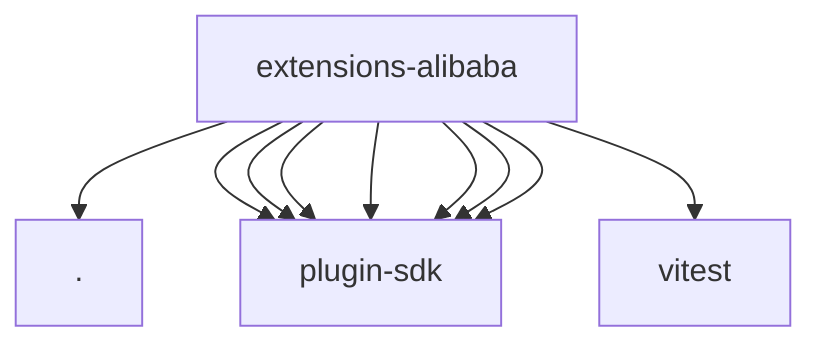

# Imports

[← Back to MODULE](MODULE.md) | [← Back to INDEX](../../INDEX.md)

## Dependency Graph

## External Dependencies

Dependencies from other modules:

- `./video-generation-provider.js`
- `openclaw/plugin-sdk/plugin-entry`
- `openclaw/plugin-sdk/provider-auth`
- `openclaw/plugin-sdk/provider-auth-runtime`
- `openclaw/plugin-sdk/provider-http`
- `openclaw/plugin-sdk/provider-http-test-mocks`
- `openclaw/plugin-sdk/provider-test-contracts`
- `openclaw/plugin-sdk/video-generation`
- `vitest`
