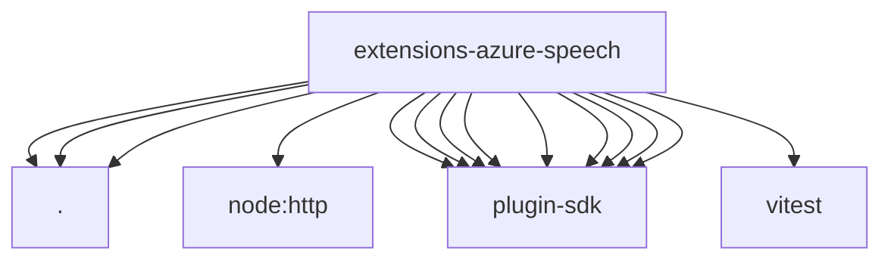

# Imports

[← Back to MODULE](MODULE.md) | [← Back to INDEX](../../INDEX.md)

## Dependency Graph

## External Dependencies

Dependencies from other modules:

- `./index.js`
- `./speech-provider.js`
- `./tts.js`
- `node:http`
- `openclaw/plugin-sdk/plugin-entry`
- `openclaw/plugin-sdk/plugin-test-runtime`
- `openclaw/plugin-sdk/provider-http`
- `openclaw/plugin-sdk/response-limit-runtime`
- `openclaw/plugin-sdk/secret-input`
- `openclaw/plugin-sdk/speech-core`
- `openclaw/plugin-sdk/ssrf-runtime`
- `openclaw/plugin-sdk/test-live`
- `openclaw/plugin-sdk/test-media-understanding`
- `vitest`
