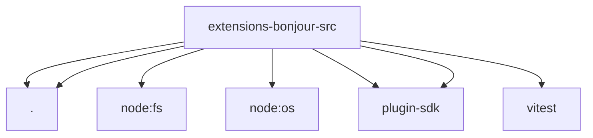

# Imports

[← Back to MODULE](MODULE.md) | [← Back to INDEX](../../INDEX.md)

## Dependency Graph

## External Dependencies

Dependencies from other modules:

- `./ciao.js`
- `./errors.js`
- `node:fs`
- `node:os`
- `openclaw/plugin-sdk/error-runtime`
- `openclaw/plugin-sdk/runtime-env`
- `vitest`
