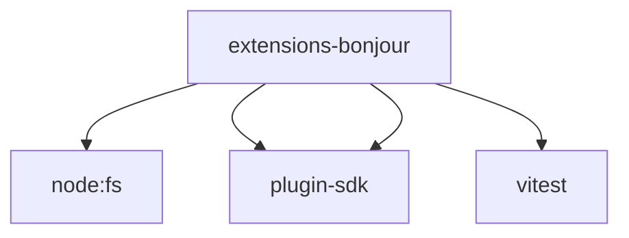

# Imports

[← Back to MODULE](MODULE.md) | [← Back to INDEX](../../INDEX.md)

## Dependency Graph

## External Dependencies

Dependencies from other modules:

- `node:fs`
- `openclaw/plugin-sdk/plugin-entry`
- `openclaw/plugin-sdk/plugin-test-api`
- `vitest`
