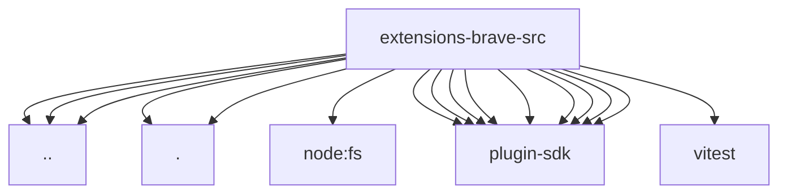

# Imports

[← Back to MODULE](MODULE.md) | [← Back to INDEX](../../INDEX.md)

## Dependency Graph

## External Dependencies

Dependencies from other modules:

- `../test-api.js`
- `../web-search-contract-api.js`
- `../web-search-shared.js`
- `./brave-web-search-provider.js`
- `./brave-web-search-provider.shared.js`
- `node:fs`
- `openclaw/plugin-sdk/diagnostic-runtime`
- `openclaw/plugin-sdk/json-schema-runtime`
- `openclaw/plugin-sdk/lazy-runtime`
- `openclaw/plugin-sdk/provider-http`
- `openclaw/plugin-sdk/provider-web-search`
- `openclaw/plugin-sdk/provider-web-search-config-contract`
- `openclaw/plugin-sdk/runtime-env`
- `openclaw/plugin-sdk/ssrf-runtime`
- `openclaw/plugin-sdk/string-coerce-runtime`
- `vitest`
