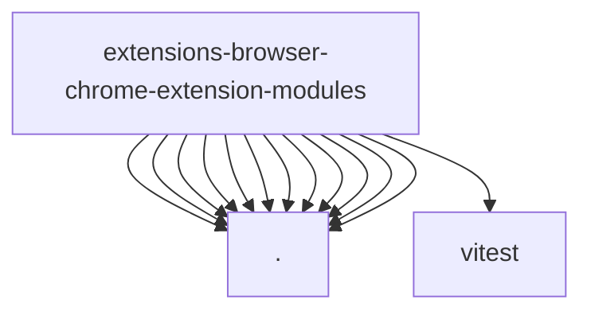

# Imports

[← Back to MODULE](MODULE.md) | [← Back to INDEX](../../INDEX.md)

## Dependency Graph

## External Dependencies

Dependencies from other modules:

- `./copilot-background-shared.js`
- `./copilot-background.js`
- `./copilot-gateway-lifecycle.js`
- `./copilot-gateway.js`
- `./copilot-recovery.js`
- `./copilot-relay-custody.js`
- `./copilot-runtime.js`
- `./copilot-session-registry.js`
- `./copilot-session.js`
- `./page-share-core.js`
- `./panel-core.js`
- `./relay-core.js`
- `vitest`
