# Imports

[← Back to MODULE](MODULE.md) | [← Back to INDEX](../../INDEX.md)

## Dependency Graph

```mermaid
graph TD
    extensions_browser_chrome_extension[extensions-browser-chrome-extension] --> src[src]
    extensions_browser_chrome_extension[extensions-browser-chrome-extension] --> src[src]
    extensions_browser_chrome_extension[extensions-browser-chrome-extension] --> __[..]
    extensions_browser_chrome_extension[extensions-browser-chrome-extension] --> modules[modules]
    extensions_browser_chrome_extension[extensions-browser-chrome-extension] --> modules[modules]
    extensions_browser_chrome_extension[extensions-browser-chrome-extension] --> modules[modules]
    extensions_browser_chrome_extension[extensions-browser-chrome-extension] --> modules[modules]
    extensions_browser_chrome_extension[extensions-browser-chrome-extension] --> node_fs[node:fs]
    extensions_browser_chrome_extension[extensions-browser-chrome-extension] --> node_http[node:http]
    extensions_browser_chrome_extension[extensions-browser-chrome-extension] --> node_os[node:os]
    extensions_browser_chrome_extension[extensions-browser-chrome-extension] --> node_path[node:path]
    extensions_browser_chrome_extension[extensions-browser-chrome-extension] --> node_url[node:url]
    extensions_browser_chrome_extension[extensions-browser-chrome-extension] --> playwright_core[playwright-core]
    extensions_browser_chrome_extension[extensions-browser-chrome-extension] --> vitest[vitest]
```

## Internal Dependencies

Dependencies within this module:

- `ws`

## External Dependencies

Dependencies from other modules:

- `../../../packages/gateway-protocol/src/client-info.js`
- `../../../packages/gateway-protocol/src/version.js`
- `../test-support.js`
- `./modules/copilot-background.js`
- `./modules/page-share-core.js`
- `./modules/panel-core.js`
- `./modules/relay-core.js`
- `node:fs/promises`
- `node:http`
- `node:os`
- `node:path`
- `node:url`
- `playwright-core`
- `vitest`
