# Imports

[← Back to MODULE](MODULE.md) | [← Back to INDEX](../../INDEX.md)

## Dependency Graph

```mermaid
graph TD
    extensions_browser_src_browser_extension_relay[extensions-browser-src-browser-extension-relay] --> __[..]
    extensions_browser_src_browser_extension_relay[extensions-browser-src-browser-extension-relay] --> gateway[gateway]
    extensions_browser_src_browser_extension_relay[extensions-browser-src-browser-extension-relay] --> infra[infra]
    extensions_browser_src_browser_extension_relay[extensions-browser-src-browser-extension-relay] --> logging[logging]
    extensions_browser_src_browser_extension_relay[extensions-browser-src-browser-extension-relay] --> __[..]
    extensions_browser_src_browser_extension_relay[extensions-browser-src-browser-extension-relay] --> __[..]
    extensions_browser_src_browser_extension_relay[extensions-browser-src-browser-extension-relay] --> _[.]
    extensions_browser_src_browser_extension_relay[extensions-browser-src-browser-extension-relay] --> _[.]
    extensions_browser_src_browser_extension_relay[extensions-browser-src-browser-extension-relay] --> _[.]
    extensions_browser_src_browser_extension_relay[extensions-browser-src-browser-extension-relay] --> _[.]
    extensions_browser_src_browser_extension_relay[extensions-browser-src-browser-extension-relay] --> _[.]
    extensions_browser_src_browser_extension_relay[extensions-browser-src-browser-extension-relay] --> _[.]
    extensions_browser_src_browser_extension_relay[extensions-browser-src-browser-extension-relay] --> _[.]
    extensions_browser_src_browser_extension_relay[extensions-browser-src-browser-extension-relay] --> node_crypto[node:crypto]
    extensions_browser_src_browser_extension_relay[extensions-browser-src-browser-extension-relay] --> node_fs[node:fs]
    extensions_browser_src_browser_extension_relay[extensions-browser-src-browser-extension-relay] --> node_os[node:os]
    extensions_browser_src_browser_extension_relay[extensions-browser-src-browser-extension-relay] --> node_path[node:path]
    extensions_browser_src_browser_extension_relay[extensions-browser-src-browser-extension-relay] --> plugin_sdk[plugin-sdk]
    extensions_browser_src_browser_extension_relay[extensions-browser-src-browser-extension-relay] --> plugin_sdk[plugin-sdk]
    extensions_browser_src_browser_extension_relay[extensions-browser-src-browser-extension-relay] --> plugin_sdk[plugin-sdk]
    extensions_browser_src_browser_extension_relay[extensions-browser-src-browser-extension-relay] --> plugin_sdk[plugin-sdk]
    extensions_browser_src_browser_extension_relay[extensions-browser-src-browser-extension-relay] --> vitest[vitest]
```

## Internal Dependencies

Dependencies within this module:

- `ws`

## External Dependencies

Dependencies from other modules:

- `../../control-service.js`
- `../../gateway/net.js`
- `../../infra/ws.js`
- `../../logging/subsystem.js`
- `../config.js`
- `../server-context.lifecycle.js`
- `./gateway-relay-route.js`
- `./page-share.js`
- `./relay-auth.js`
- `./relay-bridge.js`
- `./relay-lifecycle.js`
- `./relay-protocol.js`
- `./relay-server.js`
- `node:crypto`
- `node:fs`
- `node:os`
- `node:path`
- `openclaw/plugin-sdk/heartbeat-runtime`
- `openclaw/plugin-sdk/security-runtime`
- `openclaw/plugin-sdk/state-paths`
- `openclaw/plugin-sdk/system-event-runtime`
- `vitest`
