# Imports

[← Back to MODULE](MODULE.md) | [← Back to INDEX](../../INDEX.md)

## Dependency Graph

```mermaid
graph TD
    extensions_browser_src_browser_routes[extensions-browser-src-browser-routes] --> __[..]
    extensions_browser_src_browser_routes[extensions-browser-src-browser-routes] --> infra[infra]
    extensions_browser_src_browser_routes[extensions-browser-src-browser-routes] --> media[media]
    extensions_browser_src_browser_routes[extensions-browser-src-browser-routes] --> media[media]
    extensions_browser_src_browser_routes[extensions-browser-src-browser-routes] --> test_support[test-support]
    extensions_browser_src_browser_routes[extensions-browser-src-browser-routes] --> __[..]
    extensions_browser_src_browser_routes[extensions-browser-src-browser-routes] --> __[..]
    extensions_browser_src_browser_routes[extensions-browser-src-browser-routes] --> __[..]
    extensions_browser_src_browser_routes[extensions-browser-src-browser-routes] --> __[..]
    extensions_browser_src_browser_routes[extensions-browser-src-browser-routes] --> __[..]
    extensions_browser_src_browser_routes[extensions-browser-src-browser-routes] --> __[..]
    extensions_browser_src_browser_routes[extensions-browser-src-browser-routes] --> __[..]
    extensions_browser_src_browser_routes[extensions-browser-src-browser-routes] --> __[..]
    extensions_browser_src_browser_routes[extensions-browser-src-browser-routes] --> __[..]
    extensions_browser_src_browser_routes[extensions-browser-src-browser-routes] --> __[..]
    extensions_browser_src_browser_routes[extensions-browser-src-browser-routes] --> __[..]
    extensions_browser_src_browser_routes[extensions-browser-src-browser-routes] --> __[..]
    extensions_browser_src_browser_routes[extensions-browser-src-browser-routes] --> __[..]
    extensions_browser_src_browser_routes[extensions-browser-src-browser-routes] --> __[..]
    extensions_browser_src_browser_routes[extensions-browser-src-browser-routes] --> __[..]
    extensions_browser_src_browser_routes[extensions-browser-src-browser-routes] --> __[..]
    extensions_browser_src_browser_routes[extensions-browser-src-browser-routes] --> __[..]
    extensions_browser_src_browser_routes[extensions-browser-src-browser-routes] --> __[..]
    extensions_browser_src_browser_routes[extensions-browser-src-browser-routes] --> __[..]
    extensions_browser_src_browser_routes[extensions-browser-src-browser-routes] --> __[..]
    extensions_browser_src_browser_routes[extensions-browser-src-browser-routes] --> __[..]
    extensions_browser_src_browser_routes[extensions-browser-src-browser-routes] --> __[..]
    extensions_browser_src_browser_routes[extensions-browser-src-browser-routes] --> __[..]
    extensions_browser_src_browser_routes[extensions-browser-src-browser-routes] --> __[..]
    extensions_browser_src_browser_routes[extensions-browser-src-browser-routes] --> __[..]
    extensions_browser_src_browser_routes[extensions-browser-src-browser-routes] --> __[..]
    extensions_browser_src_browser_routes[extensions-browser-src-browser-routes] --> __[..]
    extensions_browser_src_browser_routes[extensions-browser-src-browser-routes] --> __[..]
    extensions_browser_src_browser_routes[extensions-browser-src-browser-routes] --> __[..]
    extensions_browser_src_browser_routes[extensions-browser-src-browser-routes] --> __[..]
    extensions_browser_src_browser_routes[extensions-browser-src-browser-routes] --> __[..]
    extensions_browser_src_browser_routes[extensions-browser-src-browser-routes] --> __[..]
    extensions_browser_src_browser_routes[extensions-browser-src-browser-routes] --> __[..]
    extensions_browser_src_browser_routes[extensions-browser-src-browser-routes] --> __[..]
    extensions_browser_src_browser_routes[extensions-browser-src-browser-routes] --> __[..]
    extensions_browser_src_browser_routes[extensions-browser-src-browser-routes] --> __[..]
    extensions_browser_src_browser_routes[extensions-browser-src-browser-routes] --> __[..]
    extensions_browser_src_browser_routes[extensions-browser-src-browser-routes] --> _[.]
    extensions_browser_src_browser_routes[extensions-browser-src-browser-routes] --> _[.]
    extensions_browser_src_browser_routes[extensions-browser-src-browser-routes] --> _[.]
    extensions_browser_src_browser_routes[extensions-browser-src-browser-routes] --> _[.]
    extensions_browser_src_browser_routes[extensions-browser-src-browser-routes] --> _[.]
    extensions_browser_src_browser_routes[extensions-browser-src-browser-routes] --> _[.]
    extensions_browser_src_browser_routes[extensions-browser-src-browser-routes] --> _[.]
    extensions_browser_src_browser_routes[extensions-browser-src-browser-routes] --> _[.]
    extensions_browser_src_browser_routes[extensions-browser-src-browser-routes] --> _[.]
    extensions_browser_src_browser_routes[extensions-browser-src-browser-routes] --> _[.]
    extensions_browser_src_browser_routes[extensions-browser-src-browser-routes] --> _[.]
    extensions_browser_src_browser_routes[extensions-browser-src-browser-routes] --> _[.]
    extensions_browser_src_browser_routes[extensions-browser-src-browser-routes] --> _[.]
    extensions_browser_src_browser_routes[extensions-browser-src-browser-routes] --> _[.]
    extensions_browser_src_browser_routes[extensions-browser-src-browser-routes] --> _[.]
    extensions_browser_src_browser_routes[extensions-browser-src-browser-routes] --> _[.]
    extensions_browser_src_browser_routes[extensions-browser-src-browser-routes] --> _[.]
    extensions_browser_src_browser_routes[extensions-browser-src-browser-routes] --> _[.]
    extensions_browser_src_browser_routes[extensions-browser-src-browser-routes] --> _[.]
    extensions_browser_src_browser_routes[extensions-browser-src-browser-routes] --> _[.]
    extensions_browser_src_browser_routes[extensions-browser-src-browser-routes] --> _[.]
    extensions_browser_src_browser_routes[extensions-browser-src-browser-routes] --> _[.]
    extensions_browser_src_browser_routes[extensions-browser-src-browser-routes] --> _[.]
    extensions_browser_src_browser_routes[extensions-browser-src-browser-routes] --> _[.]
    extensions_browser_src_browser_routes[extensions-browser-src-browser-routes] --> node_crypto[node:crypto]
    extensions_browser_src_browser_routes[extensions-browser-src-browser-routes] --> node_path[node:path]
    extensions_browser_src_browser_routes[extensions-browser-src-browser-routes] --> node_timers[node:timers]
    extensions_browser_src_browser_routes[extensions-browser-src-browser-routes] --> plugin_sdk[plugin-sdk]
    extensions_browser_src_browser_routes[extensions-browser-src-browser-routes] --> plugin_sdk[plugin-sdk]
    extensions_browser_src_browser_routes[extensions-browser-src-browser-routes] --> plugin_sdk[plugin-sdk]
    extensions_browser_src_browser_routes[extensions-browser-src-browser-routes] --> plugin_sdk[plugin-sdk]
    extensions_browser_src_browser_routes[extensions-browser-src-browser-routes] --> vitest[vitest]
```

## External Dependencies

Dependencies from other modules:

- `../../../test-support.js`
- `../../infra/errors.js`
- `../../media/media-services.js`
- `../../media/store.js`
- `../../test-support/browser-security.mock.js`
- `../../utils.js`
- `../act-policy.js`
- `../browser-proxy-mode.js`
- `../cdp-reachability-policy.js`
- `../cdp.helpers.js`
- `../cdp.js`
- `../chrome-mcp.js`
- `../chrome-mcp.snapshot.js`
- `../chrome.executables.js`
- `../chrome.graphics.js`
- `../chrome.js`
- `../config.js`
- `../constants.js`
- `../doctor.js`
- `../errors.js`
- `../evaluate-source.js`
- `../form-fields.js`
- `../navigation-guard.js`
- `../output-directories.js`
- `../paths.js`
- `../profile-capabilities.js`
- `../profiles-service.js`
- `../pw-ai-module.js`
- `../pw-role-snapshot.js`
- `../request-policy.js`
- `../screenshot-annotate.js`
- `../screenshot.js`
- `../server-context.chrome-test-harness.js`
- `../server-context.js`
- `../server-context.lifecycle.js`
- `../server-context.test-harness.js`
- `../snapshot-urls.js`
- `../system-profile-domains.js`
- `../system-profile-import-state.js`
- `../target-id.js`
- `../timer-delay.js`
- `../url-pattern.js`
- `./agent.act.download.js`
- `./agent.act.errors.js`
- `./agent.act.hooks.js`
- `./agent.act.js`
- `./agent.act.normalize.js`
- `./agent.act.shared.js`
- `./agent.debug.js`
- `./agent.js`
- `./agent.shared.js`
- `./agent.snapshot-target.js`
- `./agent.snapshot.js`
- `./agent.snapshot.plan.js`
- `./agent.storage.js`
- `./basic.js`
- `./existing-session-limits.js`
- `./existing-session.test-support.js`
- `./index.js`
- `./output-paths.js`
- `./path-output.js`
- `./permissions.js`
- `./route-numeric.js`
- `./tabs.js`
- `./test-helpers.js`
- `./utils.js`
- `node:crypto`
- `node:path`
- `node:timers/promises`
- `openclaw/plugin-sdk/expect-runtime`
- `openclaw/plugin-sdk/number-runtime`
- `openclaw/plugin-sdk/string-coerce-runtime`
- `openclaw/plugin-sdk/text-utility-runtime`
- `vitest`
