# Imports

[← Back to MODULE](MODULE.md) | [← Back to INDEX](../../INDEX.md)

## Dependency Graph

```mermaid
graph TD
    extensions_browser_src_cli_browser_cli_actions_input[extensions-browser-src-cli-browser-cli-actions-input] --> browser[browser]
    extensions_browser_src_cli_browser_cli_actions_input[extensions-browser-src-cli-browser-cli-actions-input] --> __[..]
    extensions_browser_src_cli_browser_cli_actions_input[extensions-browser-src-cli-browser-cli-actions-input] --> __[..]
    extensions_browser_src_cli_browser_cli_actions_input[extensions-browser-src-cli-browser-cli-actions-input] --> __[..]
    extensions_browser_src_cli_browser_cli_actions_input[extensions-browser-src-cli-browser-cli-actions-input] --> __[..]
    extensions_browser_src_cli_browser_cli_actions_input[extensions-browser-src-cli-browser-cli-actions-input] --> _[.]
    extensions_browser_src_cli_browser_cli_actions_input[extensions-browser-src-cli-browser-cli-actions-input] --> _[.]
    extensions_browser_src_cli_browser_cli_actions_input[extensions-browser-src-cli-browser-cli-actions-input] --> _[.]
    extensions_browser_src_cli_browser_cli_actions_input[extensions-browser-src-cli-browser-cli-actions-input] --> _[.]
    extensions_browser_src_cli_browser_cli_actions_input[extensions-browser-src-cli-browser-cli-actions-input] --> _[.]
    extensions_browser_src_cli_browser_cli_actions_input[extensions-browser-src-cli-browser-cli-actions-input] --> commander[commander]
    extensions_browser_src_cli_browser_cli_actions_input[extensions-browser-src-cli-browser-cli-actions-input] --> node_fs[node:fs]
    extensions_browser_src_cli_browser_cli_actions_input[extensions-browser-src-cli-browser-cli-actions-input] --> plugin_sdk[plugin-sdk]
    extensions_browser_src_cli_browser_cli_actions_input[extensions-browser-src-cli-browser-cli-actions-input] --> plugin_sdk[plugin-sdk]
    extensions_browser_src_cli_browser_cli_actions_input[extensions-browser-src-cli-browser-cli-actions-input] --> vitest[vitest]
```

## External Dependencies

Dependencies from other modules:

- `../../browser/act-policy.js`
- `../browser-cli-resize.js`
- `../browser-cli-shared.js`
- `../browser-cli.test-support.js`
- `../core-api.js`
- `./register.element.js`
- `./register.files-downloads.js`
- `./register.form-wait-eval.js`
- `./register.navigation.js`
- `./shared.js`
- `commander`
- `node:fs/promises`
- `openclaw/plugin-sdk/number-runtime`
- `openclaw/plugin-sdk/string-coerce-runtime`
- `vitest`
