# Imports

[← Back to MODULE](MODULE.md) | [← Back to INDEX](../../INDEX.md)

## Dependency Graph

```mermaid
graph TD
    extensions_browser_src_cli[extensions-browser-src-cli] --> __[..]
    extensions_browser_src_cli[extensions-browser-src-cli] --> __[..]
    extensions_browser_src_cli[extensions-browser-src-cli] --> browser[browser]
    extensions_browser_src_cli[extensions-browser-src-cli] --> browser[browser]
    extensions_browser_src_cli[extensions-browser-src-cli] --> extension_relay[extension-relay]
    extensions_browser_src_cli[extensions-browser-src-cli] --> browser[browser]
    extensions_browser_src_cli[extensions-browser-src-cli] --> __[..]
    extensions_browser_src_cli[extensions-browser-src-cli] --> gateway[gateway]
    extensions_browser_src_cli[extensions-browser-src-cli] --> __[..]
    extensions_browser_src_cli[extensions-browser-src-cli] --> _[.]
    extensions_browser_src_cli[extensions-browser-src-cli] --> _[.]
    extensions_browser_src_cli[extensions-browser-src-cli] --> _[.]
    extensions_browser_src_cli[extensions-browser-src-cli] --> _[.]
    extensions_browser_src_cli[extensions-browser-src-cli] --> _[.]
    extensions_browser_src_cli[extensions-browser-src-cli] --> _[.]
    extensions_browser_src_cli[extensions-browser-src-cli] --> _[.]
    extensions_browser_src_cli[extensions-browser-src-cli] --> _[.]
    extensions_browser_src_cli[extensions-browser-src-cli] --> commander[commander]
    extensions_browser_src_cli[extensions-browser-src-cli] --> node_fs[node:fs]
    extensions_browser_src_cli[extensions-browser-src-cli] --> node_path[node:path]
    extensions_browser_src_cli[extensions-browser-src-cli] --> node_url[node:url]
    extensions_browser_src_cli[extensions-browser-src-cli] --> plugin_sdk[plugin-sdk]
    extensions_browser_src_cli[extensions-browser-src-cli] --> plugin_sdk[plugin-sdk]
    extensions_browser_src_cli[extensions-browser-src-cli] --> plugin_sdk[plugin-sdk]
    extensions_browser_src_cli[extensions-browser-src-cli] --> vitest[vitest]
```

## External Dependencies

Dependencies from other modules:

- `../../test-support.js`
- `../browser-gateway-contract.js`
- `../browser/act-policy.js`
- `../browser/chrome.graphics.js`
- `../browser/extension-relay/relay-auth.js`
- `../browser/timer-delay.js`
- `../core-api.js`
- `../gateway/net.js`
- `../sdk-config.js`
- `./browser-cli-examples.js`
- `./browser-cli-extension-pairing.js`
- `./browser-cli-manage.test-helpers.js`
- `./browser-cli-resize.js`
- `./browser-cli-shared.js`
- `./browser-cli-state.cookies-storage.js`
- `./browser-cli.test-support.js`
- `./core-api.js`
- `commander`
- `node:fs/promises`
- `node:path`
- `node:url`
- `openclaw/plugin-sdk/cli-runtime`
- `openclaw/plugin-sdk/number-runtime`
- `openclaw/plugin-sdk/string-coerce-runtime`
- `vitest`
