# Imports

[← Back to MODULE](MODULE.md) | [← Back to INDEX](../../INDEX.md)

## Dependency Graph

```mermaid
graph TD
    extensions_canvas_scripts[extensions-canvas-scripts] --> _[.]
    extensions_canvas_scripts[extensions-canvas-scripts] --> _[.]
    extensions_canvas_scripts[extensions-canvas-scripts] --> _[.]
    extensions_canvas_scripts[extensions-canvas-scripts] --> node_child_process[node:child_process]
    extensions_canvas_scripts[extensions-canvas-scripts] --> node_crypto[node:crypto]
    extensions_canvas_scripts[extensions-canvas-scripts] --> node_fs[node:fs]
    extensions_canvas_scripts[extensions-canvas-scripts] --> node_fs[node:fs]
    extensions_canvas_scripts[extensions-canvas-scripts] --> node_module[node:module]
    extensions_canvas_scripts[extensions-canvas-scripts] --> node_os[node:os]
    extensions_canvas_scripts[extensions-canvas-scripts] --> node_path[node:path]
    extensions_canvas_scripts[extensions-canvas-scripts] --> node_url[node:url]
    extensions_canvas_scripts[extensions-canvas-scripts] --> plugin_sdk[plugin-sdk]
    extensions_canvas_scripts[extensions-canvas-scripts] --> vitest[vitest]
```

## External Dependencies

Dependencies from other modules:

- `./bundle-a2ui.mjs`
- `./copy-a2ui.mjs`
- `./pnpm-runner.mjs`
- `node:child_process`
- `node:crypto`
- `node:fs`
- `node:fs/promises`
- `node:module`
- `node:os`
- `node:path`
- `node:url`
- `openclaw/plugin-sdk/temp-path`
- `vitest`
