# Imports

[← Back to MODULE](MODULE.md) | [← Back to INDEX](../../INDEX.md)

## Dependency Graph

```mermaid
graph TD
    extensions_canvas_src_host[extensions-canvas-src-host] --> _[.]
    extensions_canvas_src_host[extensions-canvas-src-host] --> _[.]
    extensions_canvas_src_host[extensions-canvas-src-host] --> chokidar[chokidar]
    extensions_canvas_src_host[extensions-canvas-src-host] --> node_fs[node:fs]
    extensions_canvas_src_host[extensions-canvas-src-host] --> node_os[node:os]
    extensions_canvas_src_host[extensions-canvas-src-host] --> node_path[node:path]
    extensions_canvas_src_host[extensions-canvas-src-host] --> node_timers[node:timers]
    extensions_canvas_src_host[extensions-canvas-src-host] --> node_url[node:url]
    extensions_canvas_src_host[extensions-canvas-src-host] --> node_vm[node:vm]
    extensions_canvas_src_host[extensions-canvas-src-host] --> plugin_sdk[plugin-sdk]
    extensions_canvas_src_host[extensions-canvas-src-host] --> plugin_sdk[plugin-sdk]
    extensions_canvas_src_host[extensions-canvas-src-host] --> plugin_sdk[plugin-sdk]
    extensions_canvas_src_host[extensions-canvas-src-host] --> plugin_sdk[plugin-sdk]
    extensions_canvas_src_host[extensions-canvas-src-host] --> plugin_sdk[plugin-sdk]
    extensions_canvas_src_host[extensions-canvas-src-host] --> plugin_sdk[plugin-sdk]
    extensions_canvas_src_host[extensions-canvas-src-host] --> plugin_sdk[plugin-sdk]
    extensions_canvas_src_host[extensions-canvas-src-host] --> plugin_sdk[plugin-sdk]
    extensions_canvas_src_host[extensions-canvas-src-host] --> vitest[vitest]
    extensions_canvas_src_host[extensions-canvas-src-host] --> ws[ws]
```

## External Dependencies

Dependencies from other modules:

- `./a2ui-shared.js`
- `./file-resolver.js`
- `chokidar`
- `node:fs/promises`
- `node:os`
- `node:path`
- `node:timers`
- `node:url`
- `node:vm`
- `openclaw/plugin-sdk/media-mime`
- `openclaw/plugin-sdk/runtime-env`
- `openclaw/plugin-sdk/security-runtime`
- `openclaw/plugin-sdk/state-paths`
- `openclaw/plugin-sdk/string-coerce-runtime`
- `openclaw/plugin-sdk/temp-path`
- `openclaw/plugin-sdk/test-env`
- `openclaw/plugin-sdk/text-utility-runtime`
- `vitest`
- `ws`
