# Imports

[← Back to MODULE](MODULE.md) | [← Back to INDEX](../../INDEX.md)

## Dependency Graph

```mermaid
graph TD
    extensions_canvas_src[extensions-canvas-src] --> _[.]
    extensions_canvas_src[extensions-canvas-src] --> _[.]
    extensions_canvas_src[extensions-canvas-src] --> _[.]
    extensions_canvas_src[extensions-canvas-src] --> _[.]
    extensions_canvas_src[extensions-canvas-src] --> _[.]
    extensions_canvas_src[extensions-canvas-src] --> _[.]
    extensions_canvas_src[extensions-canvas-src] --> host[host]
    extensions_canvas_src[extensions-canvas-src] --> host[host]
    extensions_canvas_src[extensions-canvas-src] --> _[.]
    extensions_canvas_src[extensions-canvas-src] --> _[.]
    extensions_canvas_src[extensions-canvas-src] --> commander[commander]
    extensions_canvas_src[extensions-canvas-src] --> node_crypto[node:crypto]
    extensions_canvas_src[extensions-canvas-src] --> node_fs[node:fs]
    extensions_canvas_src[extensions-canvas-src] --> node_fs[node:fs]
    extensions_canvas_src[extensions-canvas-src] --> node_os[node:os]
    extensions_canvas_src[extensions-canvas-src] --> node_path[node:path]
    extensions_canvas_src[extensions-canvas-src] --> plugin_sdk[plugin-sdk]
    extensions_canvas_src[extensions-canvas-src] --> plugin_sdk[plugin-sdk]
    extensions_canvas_src[extensions-canvas-src] --> plugin_sdk[plugin-sdk]
    extensions_canvas_src[extensions-canvas-src] --> plugin_sdk[plugin-sdk]
    extensions_canvas_src[extensions-canvas-src] --> plugin_sdk[plugin-sdk]
    extensions_canvas_src[extensions-canvas-src] --> plugin_sdk[plugin-sdk]
    extensions_canvas_src[extensions-canvas-src] --> plugin_sdk[plugin-sdk]
    extensions_canvas_src[extensions-canvas-src] --> plugin_sdk[plugin-sdk]
    extensions_canvas_src[extensions-canvas-src] --> plugin_sdk[plugin-sdk]
    extensions_canvas_src[extensions-canvas-src] --> plugin_sdk[plugin-sdk]
    extensions_canvas_src[extensions-canvas-src] --> plugin_sdk[plugin-sdk]
    extensions_canvas_src[extensions-canvas-src] --> plugin_sdk[plugin-sdk]
    extensions_canvas_src[extensions-canvas-src] --> plugin_sdk[plugin-sdk]
    extensions_canvas_src[extensions-canvas-src] --> plugin_sdk[plugin-sdk]
    extensions_canvas_src[extensions-canvas-src] --> typebox[typebox]
    extensions_canvas_src[extensions-canvas-src] --> vitest[vitest]
```

## External Dependencies

Dependencies from other modules:

- `./a2ui-jsonl.js`
- `./cli-helpers.js`
- `./cli.js`
- `./config-migration.js`
- `./config.js`
- `./host-url.js`
- `./host/a2ui.js`
- `./host/server.js`
- `./tool-schema.js`
- `./tool.js`
- `commander`
- `node:crypto`
- `node:fs`
- `node:fs/promises`
- `node:os`
- `node:path`
- `openclaw/plugin-sdk/agent-harness-runtime`
- `openclaw/plugin-sdk/channel-actions`
- `openclaw/plugin-sdk/cli-runtime`
- `openclaw/plugin-sdk/error-runtime`
- `openclaw/plugin-sdk/gateway-runtime`
- `openclaw/plugin-sdk/number-runtime`
- `openclaw/plugin-sdk/param-readers`
- `openclaw/plugin-sdk/plugin-config-runtime`
- `openclaw/plugin-sdk/runtime`
- `openclaw/plugin-sdk/runtime-env`
- `openclaw/plugin-sdk/security-runtime`
- `openclaw/plugin-sdk/string-coerce-runtime`
- `openclaw/plugin-sdk/temp-path`
- `openclaw/plugin-sdk/text-utility-runtime`
- `typebox`
- `vitest`
