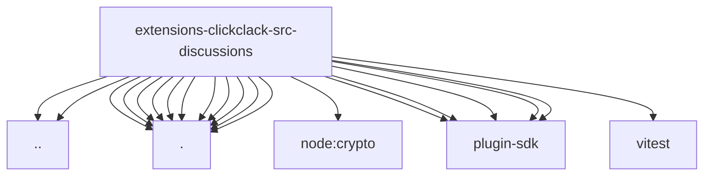

# Imports

[← Back to MODULE](MODULE.md) | [← Back to INDEX](../../INDEX.md)

## Dependency Graph

## External Dependencies

Dependencies from other modules:

- `../accounts.js`
- `../http-client.js`
- `./binding-generation.js`
- `./binding-store.js`
- `./eligibility.js`
- `./installation.js`
- `./naming.js`
- `./revoked-channel-store.js`
- `./service-open.js`
- `./service-test-support.js`
- `./service.js`
- `./tool-policy.js`
- `./tool.js`
- `node:crypto`
- `openclaw/plugin-sdk/channel-test-helpers`
- `openclaw/plugin-sdk/routing`
- `openclaw/plugin-sdk/session-discussion`
- `openclaw/plugin-sdk/session-visibility`
- `openclaw/plugin-sdk/tool-results`
- `vitest`
