# Imports

[← Back to MODULE](MODULE.md) | [← Back to INDEX](../../INDEX.md)

## Dependency Graph

```mermaid
graph TD
    extensions_clickclack_src[extensions-clickclack-src] --> _[.]
    extensions_clickclack_src[extensions-clickclack-src] --> _[.]
    extensions_clickclack_src[extensions-clickclack-src] --> _[.]
    extensions_clickclack_src[extensions-clickclack-src] --> _[.]
    extensions_clickclack_src[extensions-clickclack-src] --> _[.]
    extensions_clickclack_src[extensions-clickclack-src] --> _[.]
    extensions_clickclack_src[extensions-clickclack-src] --> _[.]
    extensions_clickclack_src[extensions-clickclack-src] --> _[.]
    extensions_clickclack_src[extensions-clickclack-src] --> discussions[discussions]
    extensions_clickclack_src[extensions-clickclack-src] --> discussions[discussions]
    extensions_clickclack_src[extensions-clickclack-src] --> discussions[discussions]
    extensions_clickclack_src[extensions-clickclack-src] --> discussions[discussions]
    extensions_clickclack_src[extensions-clickclack-src] --> _[.]
    extensions_clickclack_src[extensions-clickclack-src] --> _[.]
    extensions_clickclack_src[extensions-clickclack-src] --> _[.]
    extensions_clickclack_src[extensions-clickclack-src] --> _[.]
    extensions_clickclack_src[extensions-clickclack-src] --> _[.]
    extensions_clickclack_src[extensions-clickclack-src] --> _[.]
    extensions_clickclack_src[extensions-clickclack-src] --> _[.]
    extensions_clickclack_src[extensions-clickclack-src] --> _[.]
    extensions_clickclack_src[extensions-clickclack-src] --> _[.]
    extensions_clickclack_src[extensions-clickclack-src] --> _[.]
    extensions_clickclack_src[extensions-clickclack-src] --> _[.]
    extensions_clickclack_src[extensions-clickclack-src] --> _[.]
    extensions_clickclack_src[extensions-clickclack-src] --> _[.]
    extensions_clickclack_src[extensions-clickclack-src] --> node_crypto[node:crypto]
    extensions_clickclack_src[extensions-clickclack-src] --> node_events[node:events]
    extensions_clickclack_src[extensions-clickclack-src] --> node_fs[node:fs]
    extensions_clickclack_src[extensions-clickclack-src] --> node_http[node:http]
    extensions_clickclack_src[extensions-clickclack-src] --> node_path[node:path]
    extensions_clickclack_src[extensions-clickclack-src] --> plugin_sdk[plugin-sdk]
    extensions_clickclack_src[extensions-clickclack-src] --> plugin_sdk[plugin-sdk]
    extensions_clickclack_src[extensions-clickclack-src] --> plugin_sdk[plugin-sdk]
    extensions_clickclack_src[extensions-clickclack-src] --> plugin_sdk[plugin-sdk]
    extensions_clickclack_src[extensions-clickclack-src] --> plugin_sdk[plugin-sdk]
    extensions_clickclack_src[extensions-clickclack-src] --> plugin_sdk[plugin-sdk]
    extensions_clickclack_src[extensions-clickclack-src] --> plugin_sdk[plugin-sdk]
    extensions_clickclack_src[extensions-clickclack-src] --> plugin_sdk[plugin-sdk]
    extensions_clickclack_src[extensions-clickclack-src] --> plugin_sdk[plugin-sdk]
    extensions_clickclack_src[extensions-clickclack-src] --> plugin_sdk[plugin-sdk]
    extensions_clickclack_src[extensions-clickclack-src] --> plugin_sdk[plugin-sdk]
    extensions_clickclack_src[extensions-clickclack-src] --> plugin_sdk[plugin-sdk]
    extensions_clickclack_src[extensions-clickclack-src] --> plugin_sdk[plugin-sdk]
    extensions_clickclack_src[extensions-clickclack-src] --> plugin_sdk[plugin-sdk]
    extensions_clickclack_src[extensions-clickclack-src] --> plugin_sdk[plugin-sdk]
    extensions_clickclack_src[extensions-clickclack-src] --> plugin_sdk[plugin-sdk]
    extensions_clickclack_src[extensions-clickclack-src] --> plugin_sdk[plugin-sdk]
    extensions_clickclack_src[extensions-clickclack-src] --> plugin_sdk[plugin-sdk]
    extensions_clickclack_src[extensions-clickclack-src] --> plugin_sdk[plugin-sdk]
    extensions_clickclack_src[extensions-clickclack-src] --> plugin_sdk[plugin-sdk]
    extensions_clickclack_src[extensions-clickclack-src] --> plugin_sdk[plugin-sdk]
    extensions_clickclack_src[extensions-clickclack-src] --> plugin_sdk[plugin-sdk]
    extensions_clickclack_src[extensions-clickclack-src] --> plugin_sdk[plugin-sdk]
    extensions_clickclack_src[extensions-clickclack-src] --> plugin_sdk[plugin-sdk]
    extensions_clickclack_src[extensions-clickclack-src] --> plugin_sdk[plugin-sdk]
    extensions_clickclack_src[extensions-clickclack-src] --> plugin_sdk[plugin-sdk]
    extensions_clickclack_src[extensions-clickclack-src] --> plugin_sdk[plugin-sdk]
    extensions_clickclack_src[extensions-clickclack-src] --> plugin_sdk[plugin-sdk]
    extensions_clickclack_src[extensions-clickclack-src] --> plugin_sdk[plugin-sdk]
    extensions_clickclack_src[extensions-clickclack-src] --> plugin_sdk[plugin-sdk]
    extensions_clickclack_src[extensions-clickclack-src] --> plugin_sdk[plugin-sdk]
    extensions_clickclack_src[extensions-clickclack-src] --> plugin_sdk[plugin-sdk]
    extensions_clickclack_src[extensions-clickclack-src] --> plugin_sdk[plugin-sdk]
    extensions_clickclack_src[extensions-clickclack-src] --> plugin_sdk[plugin-sdk]
    extensions_clickclack_src[extensions-clickclack-src] --> vitest[vitest]
    extensions_clickclack_src[extensions-clickclack-src] --> ws[ws]
    extensions_clickclack_src[extensions-clickclack-src] --> zod[zod]
```

## External Dependencies

Dependencies from other modules:

- `./access.js`
- `./accounts.js`
- `./activity.js`
- `./channel-config.js`
- `./channel.js`
- `./channel.setup.js`
- `./command-menu.js`
- `./config-schema.js`
- `./discussions/binding-generation.js`
- `./discussions/binding-store.js`
- `./discussions/revoked-channel-store.js`
- `./discussions/routing.js`
- `./doctor-contract.js`
- `./gateway.js`
- `./http-client.js`
- `./inbound.js`
- `./outbound.js`
- `./resolve.js`
- `./runtime.js`
- `./secret-contract.js`
- `./setup-claim.js`
- `./setup-core.js`
- `./setup-surface.js`
- `./setup-verify.js`
- `./target.js`
- `node:crypto`
- `node:events`
- `node:fs`
- `node:http`
- `node:path`
- `openclaw/plugin-sdk/account-helpers`
- `openclaw/plugin-sdk/account-id`
- `openclaw/plugin-sdk/account-resolution`
- `openclaw/plugin-sdk/account-resolution-runtime`
- `openclaw/plugin-sdk/channel-config-schema`
- `openclaw/plugin-sdk/channel-core`
- `openclaw/plugin-sdk/channel-inbound`
- `openclaw/plugin-sdk/channel-ingress-runtime`
- `openclaw/plugin-sdk/channel-outbound`
- `openclaw/plugin-sdk/channel-plugin-common`
- `openclaw/plugin-sdk/channel-secret-basic-runtime`
- `openclaw/plugin-sdk/channel-test-helpers`
- `openclaw/plugin-sdk/error-runtime`
- `openclaw/plugin-sdk/native-command-registry`
- `openclaw/plugin-sdk/number-runtime`
- `openclaw/plugin-sdk/outbound-media`
- `openclaw/plugin-sdk/plugin-test-runtime`
- `openclaw/plugin-sdk/provider-auth`
- `openclaw/plugin-sdk/provider-http`
- `openclaw/plugin-sdk/routing`
- `openclaw/plugin-sdk/runtime-doctor`
- `openclaw/plugin-sdk/runtime-env`
- `openclaw/plugin-sdk/runtime-store`
- `openclaw/plugin-sdk/secret-file-runtime`
- `openclaw/plugin-sdk/secret-input`
- `openclaw/plugin-sdk/secret-ref-runtime`
- `openclaw/plugin-sdk/setup`
- `openclaw/plugin-sdk/setup-runtime`
- `openclaw/plugin-sdk/ssrf-runtime`
- `openclaw/plugin-sdk/status-helpers`
- `openclaw/plugin-sdk/string-coerce-runtime`
- `openclaw/plugin-sdk/test-env`
- `openclaw/plugin-sdk/text-chunking`
- `openclaw/plugin-sdk/text-utility-runtime`
- `vitest`
- `ws`
- `zod`
