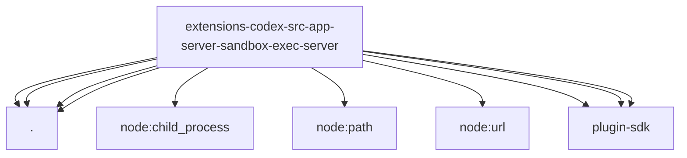

# Imports

[← Back to MODULE](MODULE.md) | [← Back to INDEX](../../INDEX.md)

## Dependency Graph

## External Dependencies

Dependencies from other modules:

- `./fs-policy.js`
- `./json-rpc.js`
- `./path-uri.js`
- `./runtime.js`
- `node:child_process`
- `node:path`
- `node:url`
- `openclaw/plugin-sdk/agent-harness-runtime`
- `openclaw/plugin-sdk/ssrf-runtime`
- `openclaw/plugin-sdk/text-utility-runtime`
