# Imports

[← Back to MODULE](MODULE.md) | [← Back to INDEX](../../INDEX.md)

## Dependency Graph

```mermaid
graph TD
    extensions_codex_src_migration[extensions-codex-src-migration] --> app_server[app-server]
    extensions_codex_src_migration[extensions-codex-src-migration] --> app_server[app-server]
    extensions_codex_src_migration[extensions-codex-src-migration] --> app_server[app-server]
    extensions_codex_src_migration[extensions-codex-src-migration] --> app_server[app-server]
    extensions_codex_src_migration[extensions-codex-src-migration] --> app_server[app-server]
    extensions_codex_src_migration[extensions-codex-src-migration] --> app_server[app-server]
    extensions_codex_src_migration[extensions-codex-src-migration] --> app_server[app-server]
    extensions_codex_src_migration[extensions-codex-src-migration] --> app_server[app-server]
    extensions_codex_src_migration[extensions-codex-src-migration] --> app_server[app-server]
    extensions_codex_src_migration[extensions-codex-src-migration] --> _[.]
    extensions_codex_src_migration[extensions-codex-src-migration] --> _[.]
    extensions_codex_src_migration[extensions-codex-src-migration] --> _[.]
    extensions_codex_src_migration[extensions-codex-src-migration] --> _[.]
    extensions_codex_src_migration[extensions-codex-src-migration] --> _[.]
    extensions_codex_src_migration[extensions-codex-src-migration] --> _[.]
    extensions_codex_src_migration[extensions-codex-src-migration] --> _[.]
    extensions_codex_src_migration[extensions-codex-src-migration] --> _[.]
    extensions_codex_src_migration[extensions-codex-src-migration] --> _[.]
    extensions_codex_src_migration[extensions-codex-src-migration] --> _[.]
    extensions_codex_src_migration[extensions-codex-src-migration] --> _[.]
    extensions_codex_src_migration[extensions-codex-src-migration] --> _[.]
    extensions_codex_src_migration[extensions-codex-src-migration] --> node_fs[node:fs]
    extensions_codex_src_migration[extensions-codex-src-migration] --> node_os[node:os]
    extensions_codex_src_migration[extensions-codex-src-migration] --> node_path[node:path]
    extensions_codex_src_migration[extensions-codex-src-migration] --> node_util[node:util]
    extensions_codex_src_migration[extensions-codex-src-migration] --> plugin_sdk[plugin-sdk]
    extensions_codex_src_migration[extensions-codex-src-migration] --> plugin_sdk[plugin-sdk]
    extensions_codex_src_migration[extensions-codex-src-migration] --> plugin_sdk[plugin-sdk]
    extensions_codex_src_migration[extensions-codex-src-migration] --> plugin_sdk[plugin-sdk]
    extensions_codex_src_migration[extensions-codex-src-migration] --> plugin_sdk[plugin-sdk]
    extensions_codex_src_migration[extensions-codex-src-migration] --> plugin_sdk[plugin-sdk]
    extensions_codex_src_migration[extensions-codex-src-migration] --> plugin_sdk[plugin-sdk]
    extensions_codex_src_migration[extensions-codex-src-migration] --> plugin_sdk[plugin-sdk]
    extensions_codex_src_migration[extensions-codex-src-migration] --> plugin_sdk[plugin-sdk]
    extensions_codex_src_migration[extensions-codex-src-migration] --> plugin_sdk[plugin-sdk]
    extensions_codex_src_migration[extensions-codex-src-migration] --> plugin_sdk[plugin-sdk]
    extensions_codex_src_migration[extensions-codex-src-migration] --> vitest[vitest]
```

## External Dependencies

Dependencies from other modules:

- `../app-server/app-inventory-cache.js`
- `../app-server/auth-bridge.js`
- `../app-server/config.js`
- `../app-server/plugin-activation.js`
- `../app-server/plugin-app-cache-key.js`
- `../app-server/plugin-inventory.js`
- `../app-server/request.js`
- `../app-server/session-binding-meta.js`
- `../app-server/shared-client.js`
- `./apply-report.js`
- `./apply.js`
- `./auth.js`
- `./helpers.js`
- `./memory-plan.js`
- `./plan.js`
- `./provider.js`
- `./session-binding-sidecar-archive.js`
- `./skill-plan.js`
- `./source-files.js`
- `./source.js`
- `./targets.js`
- `node:fs/promises`
- `node:os`
- `node:path`
- `node:util`
- `openclaw/plugin-sdk/agent-runtime`
- `openclaw/plugin-sdk/file-lock`
- `openclaw/plugin-sdk/json-store`
- `openclaw/plugin-sdk/migration`
- `openclaw/plugin-sdk/migration-runtime`
- `openclaw/plugin-sdk/number-runtime`
- `openclaw/plugin-sdk/provider-auth`
- `openclaw/plugin-sdk/runtime-env`
- `openclaw/plugin-sdk/security-runtime`
- `openclaw/plugin-sdk/session-store-runtime`
- `openclaw/plugin-sdk/string-coerce-runtime`
- `vitest`
