# Imports

[← Back to MODULE](MODULE.md) | [← Back to INDEX](../../INDEX.md)

## Dependency Graph

```mermaid
graph TD
    extensions_codex[extensions-codex] --> openai[openai]
    extensions_codex[extensions-codex] --> __[..]
    extensions_codex[extensions-codex] --> app_server[app-server]
    extensions_codex[extensions-codex] --> app_server[app-server]
    extensions_codex[extensions-codex] --> app_server[app-server]
    extensions_codex[extensions-codex] --> app_server[app-server]
    extensions_codex[extensions-codex] --> app_server[app-server]
    extensions_codex[extensions-codex] --> app_server[app-server]
    extensions_codex[extensions-codex] --> app_server[app-server]
    extensions_codex[extensions-codex] --> app_server[app-server]
    extensions_codex[extensions-codex] --> app_server[app-server]
    extensions_codex[extensions-codex] --> app_server[app-server]
    extensions_codex[extensions-codex] --> app_server[app-server]
    extensions_codex[extensions-codex] --> app_server[app-server]
    extensions_codex[extensions-codex] --> app_server[app-server]
    extensions_codex[extensions-codex] --> app_server[app-server]
    extensions_codex[extensions-codex] --> app_server[app-server]
    extensions_codex[extensions-codex] --> app_server[app-server]
    extensions_codex[extensions-codex] --> app_server[app-server]
    extensions_codex[extensions-codex] --> app_server[app-server]
    extensions_codex[extensions-codex] --> app_server[app-server]
    extensions_codex[extensions-codex] --> app_server[app-server]
    extensions_codex[extensions-codex] --> app_server[app-server]
    extensions_codex[extensions-codex] --> app_server[app-server]
    extensions_codex[extensions-codex] --> app_server[app-server]
    extensions_codex[extensions-codex] --> app_server[app-server]
    extensions_codex[extensions-codex] --> app_server[app-server]
    extensions_codex[extensions-codex] --> app_server[app-server]
    extensions_codex[extensions-codex] --> app_server[app-server]
    extensions_codex[extensions-codex] --> _[.]
    extensions_codex[extensions-codex] --> _[.]
    extensions_codex[extensions-codex] --> _[.]
    extensions_codex[extensions-codex] --> _[.]
    extensions_codex[extensions-codex] --> _[.]
    extensions_codex[extensions-codex] --> _[.]
    extensions_codex[extensions-codex] --> _[.]
    extensions_codex[extensions-codex] --> _[.]
    extensions_codex[extensions-codex] --> _[.]
    extensions_codex[extensions-codex] --> _[.]
    extensions_codex[extensions-codex] --> _[.]
    extensions_codex[extensions-codex] --> _[.]
    extensions_codex[extensions-codex] --> _[.]
    extensions_codex[extensions-codex] --> _[.]
    extensions_codex[extensions-codex] --> _[.]
    extensions_codex[extensions-codex] --> _[.]
    extensions_codex[extensions-codex] --> _[.]
    extensions_codex[extensions-codex] --> _[.]
    extensions_codex[extensions-codex] --> _[.]
    extensions_codex[extensions-codex] --> _[.]
    extensions_codex[extensions-codex] --> _[.]
    extensions_codex[extensions-codex] --> _[.]
    extensions_codex[extensions-codex] --> _[.]
    extensions_codex[extensions-codex] --> _[.]
    extensions_codex[extensions-codex] --> _[.]
    extensions_codex[extensions-codex] --> _[.]
    extensions_codex[extensions-codex] --> _[.]
    extensions_codex[extensions-codex] --> _[.]
    extensions_codex[extensions-codex] --> _[.]
    extensions_codex[extensions-codex] --> app_server[app-server]
    extensions_codex[extensions-codex] --> app_server[app-server]
    extensions_codex[extensions-codex] --> app_server[app-server]
    extensions_codex[extensions-codex] --> app_server[app-server]
    extensions_codex[extensions-codex] --> app_server[app-server]
    extensions_codex[extensions-codex] --> app_server[app-server]
    extensions_codex[extensions-codex] --> app_server[app-server]
    extensions_codex[extensions-codex] --> app_server[app-server]
    extensions_codex[extensions-codex] --> src[src]
    extensions_codex[extensions-codex] --> src[src]
    extensions_codex[extensions-codex] --> src[src]
    extensions_codex[extensions-codex] --> migration[migration]
    extensions_codex[extensions-codex] --> src[src]
    extensions_codex[extensions-codex] --> src[src]
    extensions_codex[extensions-codex] --> src[src]
    extensions_codex[extensions-codex] --> src[src]
    extensions_codex[extensions-codex] --> src[src]
    extensions_codex[extensions-codex] --> src[src]
    extensions_codex[extensions-codex] --> _[.]
    extensions_codex[extensions-codex] --> _[.]
    extensions_codex[extensions-codex] --> _[.]
    extensions_codex[extensions-codex] --> commander[commander]
    extensions_codex[extensions-codex] --> node_child_process[node:child_process]
    extensions_codex[extensions-codex] --> node_crypto[node:crypto]
    extensions_codex[extensions-codex] --> node_fs[node:fs]
    extensions_codex[extensions-codex] --> node_fs[node:fs]
    extensions_codex[extensions-codex] --> node_os[node:os]
    extensions_codex[extensions-codex] --> node_path[node:path]
    extensions_codex[extensions-codex] --> node_process[node:process]
    extensions_codex[extensions-codex] --> node_timers[node:timers]
    extensions_codex[extensions-codex] --> node_url[node:url]
    extensions_codex[extensions-codex] --> plugin_sdk[plugin-sdk]
    extensions_codex[extensions-codex] --> plugin_sdk[plugin-sdk]
    extensions_codex[extensions-codex] --> plugin_sdk[plugin-sdk]
    extensions_codex[extensions-codex] --> plugin_sdk[plugin-sdk]
    extensions_codex[extensions-codex] --> plugin_sdk[plugin-sdk]
    extensions_codex[extensions-codex] --> plugin_sdk[plugin-sdk]
    extensions_codex[extensions-codex] --> plugin_sdk[plugin-sdk]
    extensions_codex[extensions-codex] --> plugin_sdk[plugin-sdk]
    extensions_codex[extensions-codex] --> plugin_sdk[plugin-sdk]
    extensions_codex[extensions-codex] --> plugin_sdk[plugin-sdk]
    extensions_codex[extensions-codex] --> plugin_sdk[plugin-sdk]
    extensions_codex[extensions-codex] --> plugin_sdk[plugin-sdk]
    extensions_codex[extensions-codex] --> plugin_sdk[plugin-sdk]
    extensions_codex[extensions-codex] --> plugin_sdk[plugin-sdk]
    extensions_codex[extensions-codex] --> plugin_sdk[plugin-sdk]
    extensions_codex[extensions-codex] --> plugin_sdk[plugin-sdk]
    extensions_codex[extensions-codex] --> plugin_sdk[plugin-sdk]
    extensions_codex[extensions-codex] --> plugin_sdk[plugin-sdk]
    extensions_codex[extensions-codex] --> plugin_sdk[plugin-sdk]
    extensions_codex[extensions-codex] --> plugin_sdk[plugin-sdk]
    extensions_codex[extensions-codex] --> plugin_sdk[plugin-sdk]
    extensions_codex[extensions-codex] --> plugin_sdk[plugin-sdk]
    extensions_codex[extensions-codex] --> plugin_sdk[plugin-sdk]
    extensions_codex[extensions-codex] --> plugin_sdk[plugin-sdk]
    extensions_codex[extensions-codex] --> plugin_sdk[plugin-sdk]
    extensions_codex[extensions-codex] --> plugin_sdk[plugin-sdk]
    extensions_codex[extensions-codex] --> plugin_sdk[plugin-sdk]
    extensions_codex[extensions-codex] --> plugin_sdk[plugin-sdk]
    extensions_codex[extensions-codex] --> plugin_sdk[plugin-sdk]
    extensions_codex[extensions-codex] --> typebox[typebox]
    extensions_codex[extensions-codex] --> vitest[vitest]
```

## External Dependencies

Dependencies from other modules:

- `../openai/index.js`
- `../web-search-contract-api.js`
- `./app-server/app-server-policy.js`
- `./app-server/auth-bridge.js`
- `./app-server/binding-connection.js`
- `./app-server/bounded-turn.js`
- `./app-server/capabilities.js`
- `./app-server/client.js`
- `./app-server/computer-use.js`
- `./app-server/config.js`
- `./app-server/models.js`
- `./app-server/notification-correlation.js`
- `./app-server/plugin-app-cache-key.js`
- `./app-server/protocol-validators.js`
- `./app-server/protocol.js`
- `./app-server/rate-limits.js`
- `./app-server/request.js`
- `./app-server/sandbox-guard.js`
- `./app-server/session-binding.js`
- `./app-server/session-binding.test-helpers.js`
- `./app-server/session-history-import.js`
- `./app-server/shared-client.js`
- `./app-server/thread-archive-guard.js`
- `./app-server/thread-lifecycle.js`
- `./app-server/thread-resume.js`
- `./app-server/timeout.js`
- `./app-server/transcript-mirror.js`
- `./app-server/version.js`
- `./app-server/web-search.js`
- `./cli-metadata.js`
- `./command-account.js`
- `./command-authorization.js`
- `./command-diagnostics-state.js`
- `./command-dispatch.js`
- `./command-formatters.js`
- `./command-plugins-management.js`
- `./command-presentation.js`
- `./command-rpc.js`
- `./conversation-binding-data.js`
- `./conversation-binding.js`
- `./conversation-control.js`
- `./conversation-turn-collector.js`
- `./conversation-turn-input.js`
- `./doctor-contract-api.js`
- `./harness.js`
- `./index.js`
- `./media-understanding-provider.js`
- `./native-thread-tool.js`
- `./node-cli-sessions.js`
- `./session-catalog-node-adoption.js`
- `./session-catalog-node-continue.js`
- `./session-catalog-parsing.js`
- `./session-catalog-terminal.js`
- `./session-catalog-transcript-item.js`
- `./session-catalog.js`
- `./session-cli.js`
- `./session-upstream-activity.js`
- `./session-upstream-marker.js`
- `./src/app-server/bounded-turn.js`
- `./src/app-server/config.js`
- `./src/app-server/dynamic-tool-profile.js`
- `./src/app-server/dynamic-tools.js`
- `./src/app-server/session-binding-store.js`
- `./src/app-server/session-binding.js`
- `./src/app-server/session-binding.test-helpers.js`
- `./src/app-server/thread-lifecycle.js`
- `./src/commands.js`
- `./src/conversation-binding-data.js`
- `./src/conversation-binding.js`
- `./src/migration/provider.js`
- `./src/native-thread-tool.js`
- `./src/node-cli-sessions.js`
- `./src/session-catalog.js`
- `./src/supervision-tools.js`
- `./src/web-search-provider.js`
- `./src/web-search-provider.shared.js`
- `./supervision-tools.js`
- `./web-search-provider.js`
- `./web-search-provider.shared.js`
- `commander`
- `node:child_process`
- `node:crypto`
- `node:fs`
- `node:fs/promises`
- `node:os`
- `node:path`
- `node:process`
- `node:timers/promises`
- `node:url`
- `openclaw/plugin-sdk/agent-harness-runtime`
- `openclaw/plugin-sdk/agent-runtime`
- `openclaw/plugin-sdk/config-mutation`
- `openclaw/plugin-sdk/core`
- `openclaw/plugin-sdk/exec-approvals-runtime`
- `openclaw/plugin-sdk/expect-runtime`
- `openclaw/plugin-sdk/gateway-runtime`
- `openclaw/plugin-sdk/json-schema-runtime`
- `openclaw/plugin-sdk/keyed-async-queue`
- `openclaw/plugin-sdk/lazy-runtime`
- `openclaw/plugin-sdk/model-session-runtime`
- `openclaw/plugin-sdk/node-host`
- `openclaw/plugin-sdk/number-runtime`
- `openclaw/plugin-sdk/plugin-config-runtime`
- `openclaw/plugin-sdk/plugin-entry`
- `openclaw/plugin-sdk/plugin-state-test-runtime`
- `openclaw/plugin-sdk/plugin-test-api`
- `openclaw/plugin-sdk/plugin-test-runtime`
- `openclaw/plugin-sdk/provider-auth`
- `openclaw/plugin-sdk/provider-web-search`
- `openclaw/plugin-sdk/provider-web-search-contract`
- `openclaw/plugin-sdk/routing`
- `openclaw/plugin-sdk/session-store-runtime`
- `openclaw/plugin-sdk/string-coerce-runtime`
- `openclaw/plugin-sdk/temp-path`
- `openclaw/plugin-sdk/test-env`
- `openclaw/plugin-sdk/text-chunking`
- `openclaw/plugin-sdk/text-utility-runtime`
- `openclaw/plugin-sdk/windows-spawn`
- `typebox`
- `vitest`
