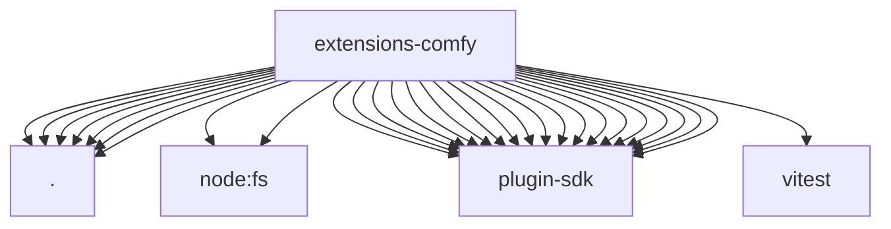

# Imports

[← Back to MODULE](MODULE.md) | [← Back to INDEX](../../INDEX.md)

## Dependency Graph

## External Dependencies

Dependencies from other modules:

- `./image-generation-provider.js`
- `./index.js`
- `./music-generation-provider.js`
- `./test-helpers.js`
- `./test-support.js`
- `./video-generation-provider.js`
- `./workflow-runtime.js`
- `node:fs`
- `node:fs/promises`
- `openclaw/plugin-sdk/agent-runtime`
- `openclaw/plugin-sdk/extension-shared`
- `openclaw/plugin-sdk/media-mime`
- `openclaw/plugin-sdk/number-runtime`
- `openclaw/plugin-sdk/plugin-entry`
- `openclaw/plugin-sdk/plugin-test-api`
- `openclaw/plugin-sdk/plugin-test-runtime`
- `openclaw/plugin-sdk/provider-auth`
- `openclaw/plugin-sdk/provider-auth-api-key`
- `openclaw/plugin-sdk/provider-auth-runtime`
- `openclaw/plugin-sdk/provider-http`
- `openclaw/plugin-sdk/provider-test-contracts`
- `openclaw/plugin-sdk/response-limit-runtime`
- `openclaw/plugin-sdk/runtime-config-snapshot`
- `openclaw/plugin-sdk/secret-input-runtime`
- `openclaw/plugin-sdk/ssrf-runtime`
- `openclaw/plugin-sdk/string-coerce-runtime`
- `openclaw/plugin-sdk/test-live`
- `openclaw/plugin-sdk/text-utility-runtime`
- `vitest`
