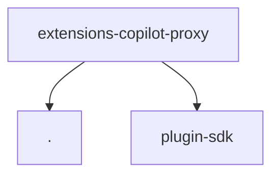

# Module: extensions/copilot-proxy

[← Back to INDEX](../../INDEX.md)

**Type:** js/ts | **Files:** 2

**Entry point:** `extensions/copilot-proxy/index.ts`

## Files

| File | Lines | Large |
| ---- | ----- | ----- |
| `extensions/copilot-proxy/index.ts` | 144 |  |
| `extensions/copilot-proxy/runtime-api.ts` | 7 |  |

---

## External Dependencies

Dependencies from other modules:

- `./runtime-api.js`
- `openclaw/plugin-sdk/string-coerce-runtime`
