# Imports

[← Back to MODULE](MODULE.md) | [← Back to INDEX](../../INDEX.md)

## Dependency Graph

```mermaid
graph TD
    extensions_deepinfra[extensions-deepinfra] --> _[.]
    extensions_deepinfra[extensions-deepinfra] --> _[.]
    extensions_deepinfra[extensions-deepinfra] --> _[.]
    extensions_deepinfra[extensions-deepinfra] --> _[.]
    extensions_deepinfra[extensions-deepinfra] --> _[.]
    extensions_deepinfra[extensions-deepinfra] --> _[.]
    extensions_deepinfra[extensions-deepinfra] --> _[.]
    extensions_deepinfra[extensions-deepinfra] --> _[.]
    extensions_deepinfra[extensions-deepinfra] --> _[.]
    extensions_deepinfra[extensions-deepinfra] --> _[.]
    extensions_deepinfra[extensions-deepinfra] --> _[.]
    extensions_deepinfra[extensions-deepinfra] --> _[.]
    extensions_deepinfra[extensions-deepinfra] --> _[.]
    extensions_deepinfra[extensions-deepinfra] --> _[.]
    extensions_deepinfra[extensions-deepinfra] --> _[.]
    extensions_deepinfra[extensions-deepinfra] --> node_fs[node:fs]
    extensions_deepinfra[extensions-deepinfra] --> node_os[node:os]
    extensions_deepinfra[extensions-deepinfra] --> node_path[node:path]
    extensions_deepinfra[extensions-deepinfra] --> plugin_sdk[plugin-sdk]
    extensions_deepinfra[extensions-deepinfra] --> plugin_sdk[plugin-sdk]
    extensions_deepinfra[extensions-deepinfra] --> plugin_sdk[plugin-sdk]
    extensions_deepinfra[extensions-deepinfra] --> plugin_sdk[plugin-sdk]
    extensions_deepinfra[extensions-deepinfra] --> plugin_sdk[plugin-sdk]
    extensions_deepinfra[extensions-deepinfra] --> plugin_sdk[plugin-sdk]
    extensions_deepinfra[extensions-deepinfra] --> plugin_sdk[plugin-sdk]
    extensions_deepinfra[extensions-deepinfra] --> plugin_sdk[plugin-sdk]
    extensions_deepinfra[extensions-deepinfra] --> plugin_sdk[plugin-sdk]
    extensions_deepinfra[extensions-deepinfra] --> plugin_sdk[plugin-sdk]
    extensions_deepinfra[extensions-deepinfra] --> plugin_sdk[plugin-sdk]
    extensions_deepinfra[extensions-deepinfra] --> plugin_sdk[plugin-sdk]
    extensions_deepinfra[extensions-deepinfra] --> plugin_sdk[plugin-sdk]
    extensions_deepinfra[extensions-deepinfra] --> plugin_sdk[plugin-sdk]
    extensions_deepinfra[extensions-deepinfra] --> plugin_sdk[plugin-sdk]
    extensions_deepinfra[extensions-deepinfra] --> plugin_sdk[plugin-sdk]
    extensions_deepinfra[extensions-deepinfra] --> plugin_sdk[plugin-sdk]
    extensions_deepinfra[extensions-deepinfra] --> plugin_sdk[plugin-sdk]
    extensions_deepinfra[extensions-deepinfra] --> plugin_sdk[plugin-sdk]
    extensions_deepinfra[extensions-deepinfra] --> plugin_sdk[plugin-sdk]
    extensions_deepinfra[extensions-deepinfra] --> plugin_sdk[plugin-sdk]
    extensions_deepinfra[extensions-deepinfra] --> plugin_sdk[plugin-sdk]
    extensions_deepinfra[extensions-deepinfra] --> plugin_sdk[plugin-sdk]
    extensions_deepinfra[extensions-deepinfra] --> plugin_sdk[plugin-sdk]
    extensions_deepinfra[extensions-deepinfra] --> vitest[vitest]
```

## External Dependencies

Dependencies from other modules:

- `./cache-wrapper.js`
- `./embedding-provider.js`
- `./image-generation-provider.js`
- `./index.js`
- `./media-models.js`
- `./media-understanding-provider.js`
- `./memory-embedding-adapter.js`
- `./onboard.js`
- `./openclaw.plugin.json`
- `./provider-catalog.js`
- `./provider-models.js`
- `./provider-policy-api.js`
- `./speech-provider.js`
- `./surface-model-catalogs.js`
- `./video-generation-provider.js`
- `node:fs`
- `node:os`
- `node:path`
- `openclaw/plugin-sdk/fetch-runtime`
- `openclaw/plugin-sdk/image-generation`
- `openclaw/plugin-sdk/media-mime`
- `openclaw/plugin-sdk/media-runtime`
- `openclaw/plugin-sdk/media-understanding`
- `openclaw/plugin-sdk/memory-core-host-engine-embeddings`
- `openclaw/plugin-sdk/plugin-test-runtime`
- `openclaw/plugin-sdk/provider-auth`
- `openclaw/plugin-sdk/provider-auth-runtime`
- `openclaw/plugin-sdk/provider-catalog-live-runtime`
- `openclaw/plugin-sdk/provider-catalog-shared`
- `openclaw/plugin-sdk/provider-entry`
- `openclaw/plugin-sdk/provider-http`
- `openclaw/plugin-sdk/provider-http-test-mocks`
- `openclaw/plugin-sdk/provider-model-shared`
- `openclaw/plugin-sdk/provider-onboard`
- `openclaw/plugin-sdk/provider-stream`
- `openclaw/plugin-sdk/provider-test-contracts`
- `openclaw/plugin-sdk/runtime-env`
- `openclaw/plugin-sdk/secret-input`
- `openclaw/plugin-sdk/speech`
- `openclaw/plugin-sdk/ssrf-runtime`
- `openclaw/plugin-sdk/string-coerce-runtime`
- `openclaw/plugin-sdk/test-env`
- `vitest`
