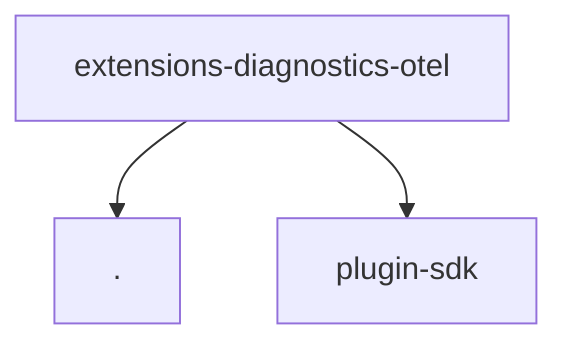

# Module: extensions/diagnostics-otel

[← Back to INDEX](../../INDEX.md)

**Type:** js/ts | **Files:** 3

**Entry point:** `extensions/diagnostics-otel/index.ts`

## Files

| File | Lines | Large |
| ---- | ----- | ----- |
| `extensions/diagnostics-otel/api.ts` | 22 |  |
| `extensions/diagnostics-otel/index.ts` | 12 |  |
| `extensions/diagnostics-otel/runtime-api.ts` | 3 |  |

## Child Modules

- [extensions-diagnostics-otel-src](../extensions-diagnostics-otel-src/MODULE.md)

---

## External Dependencies

Dependencies from other modules:

- `./runtime-api.js`
- `openclaw/plugin-sdk/plugin-entry`
