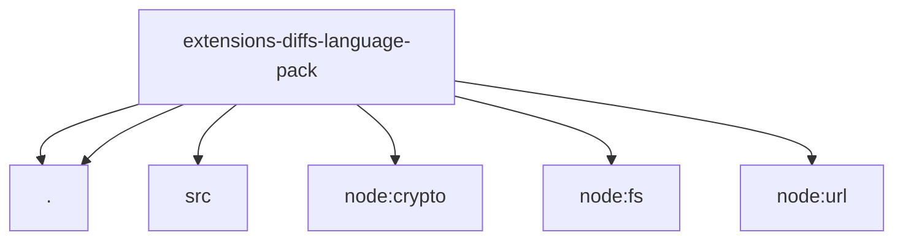

# Imports

[← Back to MODULE](MODULE.md) | [← Back to INDEX](../../INDEX.md)

## Dependency Graph

## External Dependencies

Dependencies from other modules:

- `./api.js`
- `./src/plugin.js`
- `./viewer-assets.js`
- `node:crypto`
- `node:fs/promises`
- `node:url`
