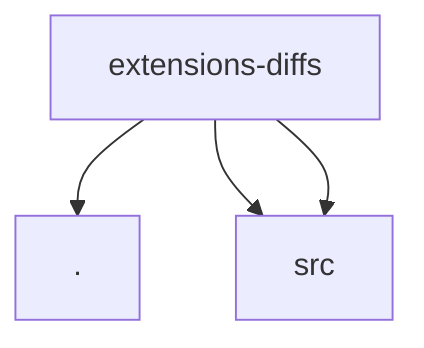

# Module: extensions/diffs

[← Back to INDEX](../../INDEX.md)

**Type:** js/ts | **Files:** 3

**Entry point:** `extensions/diffs/index.ts`

## Files

| File | Lines | Large |
| ---- | ----- | ----- |
| `extensions/diffs/api.ts` | 11 |  |
| `extensions/diffs/index.ts` | 12 |  |
| `extensions/diffs/runtime-api.ts` | 2 |  |

## Child Modules

- [extensions-diffs-src](../extensions-diffs-src/MODULE.md)

---

## External Dependencies

Dependencies from other modules:

- `./api.js`
- `./src/config.js`
- `./src/plugin.js`
