# Imports

[← Back to MODULE](MODULE.md) | [← Back to INDEX](../../INDEX.md)

## Dependency Graph

```mermaid
graph TD
    extensions_discord_src_activities[extensions-discord-src-activities] --> __[..]
    extensions_discord_src_activities[extensions-discord-src-activities] --> __[..]
    extensions_discord_src_activities[extensions-discord-src-activities] --> __[..]
    extensions_discord_src_activities[extensions-discord-src-activities] --> __[..]
    extensions_discord_src_activities[extensions-discord-src-activities] --> internal[internal]
    extensions_discord_src_activities[extensions-discord-src-activities] --> internal[internal]
    extensions_discord_src_activities[extensions-discord-src-activities] --> internal[internal]
    extensions_discord_src_activities[extensions-discord-src-activities] --> monitor[monitor]
    extensions_discord_src_activities[extensions-discord-src-activities] --> __[..]
    extensions_discord_src_activities[extensions-discord-src-activities] --> __[..]
    extensions_discord_src_activities[extensions-discord-src-activities] --> __[..]
    extensions_discord_src_activities[extensions-discord-src-activities] --> __[..]
    extensions_discord_src_activities[extensions-discord-src-activities] --> __[..]
    extensions_discord_src_activities[extensions-discord-src-activities] --> _[.]
    extensions_discord_src_activities[extensions-discord-src-activities] --> _[.]
    extensions_discord_src_activities[extensions-discord-src-activities] --> _[.]
    extensions_discord_src_activities[extensions-discord-src-activities] --> _[.]
    extensions_discord_src_activities[extensions-discord-src-activities] --> _[.]
    extensions_discord_src_activities[extensions-discord-src-activities] --> _[.]
    extensions_discord_src_activities[extensions-discord-src-activities] --> _[.]
    extensions_discord_src_activities[extensions-discord-src-activities] --> _[.]
    extensions_discord_src_activities[extensions-discord-src-activities] --> _[.]
    extensions_discord_src_activities[extensions-discord-src-activities] --> _[.]
    extensions_discord_src_activities[extensions-discord-src-activities] --> _[.]
    extensions_discord_src_activities[extensions-discord-src-activities] --> discord_api_types[discord-api-types]
    extensions_discord_src_activities[extensions-discord-src-activities] --> node_crypto[node:crypto]
    extensions_discord_src_activities[extensions-discord-src-activities] --> node_fs[node:fs]
    extensions_discord_src_activities[extensions-discord-src-activities] --> node_http[node:http]
    extensions_discord_src_activities[extensions-discord-src-activities] --> node_os[node:os]
    extensions_discord_src_activities[extensions-discord-src-activities] --> node_path[node:path]
    extensions_discord_src_activities[extensions-discord-src-activities] --> node_vm[node:vm]
    extensions_discord_src_activities[extensions-discord-src-activities] --> plugin_sdk[plugin-sdk]
    extensions_discord_src_activities[extensions-discord-src-activities] --> plugin_sdk[plugin-sdk]
    extensions_discord_src_activities[extensions-discord-src-activities] --> plugin_sdk[plugin-sdk]
    extensions_discord_src_activities[extensions-discord-src-activities] --> plugin_sdk[plugin-sdk]
    extensions_discord_src_activities[extensions-discord-src-activities] --> plugin_sdk[plugin-sdk]
    extensions_discord_src_activities[extensions-discord-src-activities] --> plugin_sdk[plugin-sdk]
    extensions_discord_src_activities[extensions-discord-src-activities] --> plugin_sdk[plugin-sdk]
    extensions_discord_src_activities[extensions-discord-src-activities] --> plugin_sdk[plugin-sdk]
    extensions_discord_src_activities[extensions-discord-src-activities] --> typebox[typebox]
    extensions_discord_src_activities[extensions-discord-src-activities] --> vitest[vitest]
```

## External Dependencies

Dependencies from other modules:

- `../../config-api.js`
- `../accounts.js`
- `../component-custom-id.js`
- `../components.js`
- `../internal/discord.js`
- `../internal/interactions.js`
- `../internal/test-builders.test-support.js`
- `../monitor/agent-components-reply.js`
- `../proxy-fetch.js`
- `../send.components.js`
- `../send.receipt.js`
- `../shared-interactive.js`
- `../target-parsing.js`
- `./config.js`
- `./discord-api.js`
- `./http.js`
- `./interaction.js`
- `./rate-limit.js`
- `./register.js`
- `./runtime.js`
- `./shell.js`
- `./store.js`
- `./test-helpers.test-support.js`
- `./tool.js`
- `discord-api-types/v10`
- `node:crypto`
- `node:fs/promises`
- `node:http`
- `node:os`
- `node:path`
- `node:vm`
- `openclaw/plugin-sdk/channel-actions`
- `openclaw/plugin-sdk/logging-core`
- `openclaw/plugin-sdk/provider-http`
- `openclaw/plugin-sdk/ssrf-runtime`
- `openclaw/plugin-sdk/text-utility-runtime`
- `openclaw/plugin-sdk/webhook-ingress`
- `openclaw/plugin-sdk/webhook-request-guards`
- `openclaw/plugin-sdk/widget-html`
- `typebox`
- `vitest`
