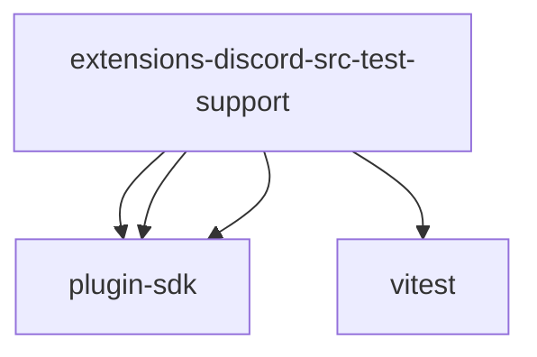

# Imports

[← Back to MODULE](MODULE.md) | [← Back to INDEX](../../INDEX.md)

## Dependency Graph

## External Dependencies

Dependencies from other modules:

- `openclaw/plugin-sdk/channel-test-helpers`
- `openclaw/plugin-sdk/conversation-runtime`
- `openclaw/plugin-sdk/reply-reference`
- `vitest`
