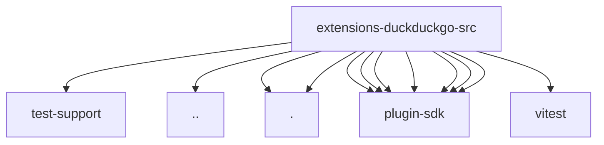

# Imports

[← Back to MODULE](MODULE.md) | [← Back to INDEX](../../INDEX.md)

## Dependency Graph

## External Dependencies

Dependencies from other modules:

- `../../test-support/streaming-error-response.js`
- `../web-search-contract-api.js`
- `./config.js`
- `./ddg-search-provider.shared.js`
- `openclaw/plugin-sdk/html-entity-runtime`
- `openclaw/plugin-sdk/lazy-runtime`
- `openclaw/plugin-sdk/param-readers`
- `openclaw/plugin-sdk/provider-http`
- `openclaw/plugin-sdk/provider-web-search`
- `openclaw/plugin-sdk/provider-web-search-contract`
- `openclaw/plugin-sdk/string-coerce-runtime`
- `vitest`
