# Imports

[← Back to MODULE](MODULE.md) | [← Back to INDEX](../../INDEX.md)

## Dependency Graph

```mermaid
graph TD
    extensions_elevenlabs[extensions-elevenlabs] --> test_support[test-support]
    extensions_elevenlabs[extensions-elevenlabs] --> _[.]
    extensions_elevenlabs[extensions-elevenlabs] --> _[.]
    extensions_elevenlabs[extensions-elevenlabs] --> _[.]
    extensions_elevenlabs[extensions-elevenlabs] --> _[.]
    extensions_elevenlabs[extensions-elevenlabs] --> _[.]
    extensions_elevenlabs[extensions-elevenlabs] --> _[.]
    extensions_elevenlabs[extensions-elevenlabs] --> _[.]
    extensions_elevenlabs[extensions-elevenlabs] --> _[.]
    extensions_elevenlabs[extensions-elevenlabs] --> node_fs[node:fs]
    extensions_elevenlabs[extensions-elevenlabs] --> node_http[node:http]
    extensions_elevenlabs[extensions-elevenlabs] --> node_os[node:os]
    extensions_elevenlabs[extensions-elevenlabs] --> node_path[node:path]
    extensions_elevenlabs[extensions-elevenlabs] --> plugin_sdk[plugin-sdk]
    extensions_elevenlabs[extensions-elevenlabs] --> plugin_sdk[plugin-sdk]
    extensions_elevenlabs[extensions-elevenlabs] --> plugin_sdk[plugin-sdk]
    extensions_elevenlabs[extensions-elevenlabs] --> plugin_sdk[plugin-sdk]
    extensions_elevenlabs[extensions-elevenlabs] --> plugin_sdk[plugin-sdk]
    extensions_elevenlabs[extensions-elevenlabs] --> plugin_sdk[plugin-sdk]
    extensions_elevenlabs[extensions-elevenlabs] --> plugin_sdk[plugin-sdk]
    extensions_elevenlabs[extensions-elevenlabs] --> plugin_sdk[plugin-sdk]
    extensions_elevenlabs[extensions-elevenlabs] --> plugin_sdk[plugin-sdk]
    extensions_elevenlabs[extensions-elevenlabs] --> plugin_sdk[plugin-sdk]
    extensions_elevenlabs[extensions-elevenlabs] --> plugin_sdk[plugin-sdk]
    extensions_elevenlabs[extensions-elevenlabs] --> plugin_sdk[plugin-sdk]
    extensions_elevenlabs[extensions-elevenlabs] --> plugin_sdk[plugin-sdk]
    extensions_elevenlabs[extensions-elevenlabs] --> plugin_sdk[plugin-sdk]
    extensions_elevenlabs[extensions-elevenlabs] --> plugin_sdk[plugin-sdk]
    extensions_elevenlabs[extensions-elevenlabs] --> vitest[vitest]
    extensions_elevenlabs[extensions-elevenlabs] --> ws[ws]
```

## External Dependencies

Dependencies from other modules:

- `../test-support/streaming-error-response.js`
- `./config-api.js`
- `./config-compat.js`
- `./index.js`
- `./media-understanding-provider.js`
- `./realtime-transcription-provider.js`
- `./shared.js`
- `./speech-provider.js`
- `./tts.js`
- `node:fs`
- `node:http`
- `node:os`
- `node:path`
- `openclaw/plugin-sdk/error-runtime`
- `openclaw/plugin-sdk/media-runtime`
- `openclaw/plugin-sdk/number-runtime`
- `openclaw/plugin-sdk/plugin-entry`
- `openclaw/plugin-sdk/plugin-test-runtime`
- `openclaw/plugin-sdk/provider-http`
- `openclaw/plugin-sdk/provider-test-contracts`
- `openclaw/plugin-sdk/realtime-transcription`
- `openclaw/plugin-sdk/secret-input`
- `openclaw/plugin-sdk/speech`
- `openclaw/plugin-sdk/speech-core`
- `openclaw/plugin-sdk/ssrf-runtime`
- `openclaw/plugin-sdk/string-coerce-runtime`
- `openclaw/plugin-sdk/test-env`
- `openclaw/plugin-sdk/test-live`
- `vitest`
- `ws`
