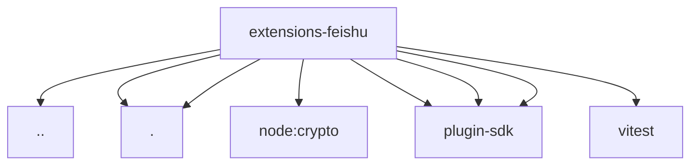

# Imports

[← Back to MODULE](MODULE.md) | [← Back to INDEX](../../INDEX.md)

## Dependency Graph

## External Dependencies

Dependencies from other modules:

- `../runtime.js`
- `./doctor-contract-api.js`
- `./subagent-hooks-api.js`
- `node:crypto`
- `openclaw/plugin-sdk/channel-entry-contract`
- `openclaw/plugin-sdk/channel-test-helpers`
- `openclaw/plugin-sdk/lazy-runtime`
- `vitest`
