# Imports

[← Back to MODULE](MODULE.md) | [← Back to INDEX](../../INDEX.md)

## Dependency Graph

```mermaid
graph TD
    extensions_file_transfer_src_node_host[extensions-file-transfer-src-node-host] --> shared[shared]
    extensions_file_transfer_src_node_host[extensions-file-transfer-src-node-host] --> shared[shared]
    extensions_file_transfer_src_node_host[extensions-file-transfer-src-node-host] --> _[.]
    extensions_file_transfer_src_node_host[extensions-file-transfer-src-node-host] --> _[.]
    extensions_file_transfer_src_node_host[extensions-file-transfer-src-node-host] --> _[.]
    extensions_file_transfer_src_node_host[extensions-file-transfer-src-node-host] --> _[.]
    extensions_file_transfer_src_node_host[extensions-file-transfer-src-node-host] --> _[.]
    extensions_file_transfer_src_node_host[extensions-file-transfer-src-node-host] --> node_crypto[node:crypto]
    extensions_file_transfer_src_node_host[extensions-file-transfer-src-node-host] --> node_fs[node:fs]
    extensions_file_transfer_src_node_host[extensions-file-transfer-src-node-host] --> node_os[node:os]
    extensions_file_transfer_src_node_host[extensions-file-transfer-src-node-host] --> node_path[node:path]
    extensions_file_transfer_src_node_host[extensions-file-transfer-src-node-host] --> plugin_sdk[plugin-sdk]
    extensions_file_transfer_src_node_host[extensions-file-transfer-src-node-host] --> plugin_sdk[plugin-sdk]
    extensions_file_transfer_src_node_host[extensions-file-transfer-src-node-host] --> plugin_sdk[plugin-sdk]
    extensions_file_transfer_src_node_host[extensions-file-transfer-src-node-host] --> plugin_sdk[plugin-sdk]
    extensions_file_transfer_src_node_host[extensions-file-transfer-src-node-host] --> vitest[vitest]
```

## External Dependencies

Dependencies from other modules:

- `../shared/base64.js`
- `../shared/mime.js`
- `./dir-fetch.js`
- `./dir-list.js`
- `./file-fetch.js`
- `./file-write.js`
- `./path-errors.js`
- `node:crypto`
- `node:fs/promises`
- `node:os`
- `node:path`
- `openclaw/plugin-sdk/media-mime`
- `openclaw/plugin-sdk/number-runtime`
- `openclaw/plugin-sdk/process-runtime`
- `openclaw/plugin-sdk/security-runtime`
- `vitest`
