# Imports

[← Back to MODULE](MODULE.md) | [← Back to INDEX](../../INDEX.md)

## Dependency Graph

```mermaid
graph TD
    extensions_file_transfer_src_tools[extensions-file-transfer-src-tools] --> shared[shared]
    extensions_file_transfer_src_tools[extensions-file-transfer-src-tools] --> shared[shared]
    extensions_file_transfer_src_tools[extensions-file-transfer-src-tools] --> shared[shared]
    extensions_file_transfer_src_tools[extensions-file-transfer-src-tools] --> shared[shared]
    extensions_file_transfer_src_tools[extensions-file-transfer-src-tools] --> shared[shared]
    extensions_file_transfer_src_tools[extensions-file-transfer-src-tools] --> shared[shared]
    extensions_file_transfer_src_tools[extensions-file-transfer-src-tools] --> _[.]
    extensions_file_transfer_src_tools[extensions-file-transfer-src-tools] --> _[.]
    extensions_file_transfer_src_tools[extensions-file-transfer-src-tools] --> _[.]
    extensions_file_transfer_src_tools[extensions-file-transfer-src-tools] --> _[.]
    extensions_file_transfer_src_tools[extensions-file-transfer-src-tools] --> _[.]
    extensions_file_transfer_src_tools[extensions-file-transfer-src-tools] --> node_crypto[node:crypto]
    extensions_file_transfer_src_tools[extensions-file-transfer-src-tools] --> node_fs[node:fs]
    extensions_file_transfer_src_tools[extensions-file-transfer-src-tools] --> node_os[node:os]
    extensions_file_transfer_src_tools[extensions-file-transfer-src-tools] --> node_path[node:path]
    extensions_file_transfer_src_tools[extensions-file-transfer-src-tools] --> node_string_decoder[node:string_decoder]
    extensions_file_transfer_src_tools[extensions-file-transfer-src-tools] --> plugin_sdk[plugin-sdk]
    extensions_file_transfer_src_tools[extensions-file-transfer-src-tools] --> plugin_sdk[plugin-sdk]
    extensions_file_transfer_src_tools[extensions-file-transfer-src-tools] --> plugin_sdk[plugin-sdk]
    extensions_file_transfer_src_tools[extensions-file-transfer-src-tools] --> plugin_sdk[plugin-sdk]
    extensions_file_transfer_src_tools[extensions-file-transfer-src-tools] --> plugin_sdk[plugin-sdk]
    extensions_file_transfer_src_tools[extensions-file-transfer-src-tools] --> plugin_sdk[plugin-sdk]
    extensions_file_transfer_src_tools[extensions-file-transfer-src-tools] --> plugin_sdk[plugin-sdk]
    extensions_file_transfer_src_tools[extensions-file-transfer-src-tools] --> typebox[typebox]
    extensions_file_transfer_src_tools[extensions-file-transfer-src-tools] --> vitest[vitest]
```

## External Dependencies

Dependencies from other modules:

- `../shared/append-bounded-text-tail.js`
- `../shared/audit.js`
- `../shared/base64.js`
- `../shared/errors.js`
- `../shared/mime.js`
- `../shared/params.js`
- `./descriptors.js`
- `./dir-list-tool.js`
- `./file-fetch-tool.js`
- `./file-write-tool.js`
- `./node-tool-invoke.js`
- `node:crypto`
- `node:fs/promises`
- `node:os`
- `node:path`
- `node:string_decoder`
- `openclaw/plugin-sdk/agent-harness-runtime`
- `openclaw/plugin-sdk/channel-actions`
- `openclaw/plugin-sdk/error-runtime`
- `openclaw/plugin-sdk/media-store`
- `openclaw/plugin-sdk/param-readers`
- `openclaw/plugin-sdk/process-runtime`
- `openclaw/plugin-sdk/security-runtime`
- `typebox`
- `vitest`
