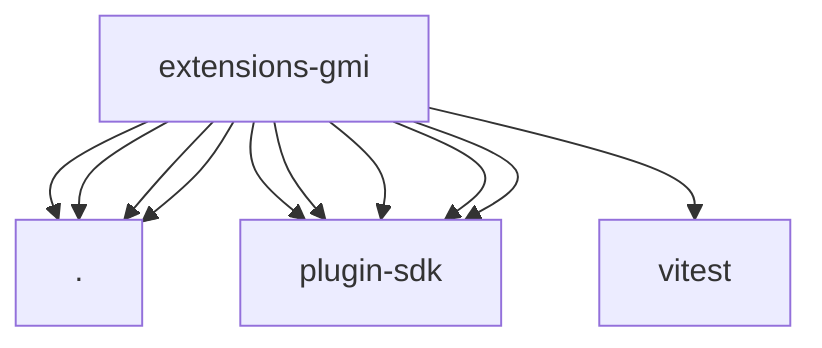

# Imports

[← Back to MODULE](MODULE.md) | [← Back to INDEX](../../INDEX.md)

## Dependency Graph

## External Dependencies

Dependencies from other modules:

- `./index.js`
- `./models.js`
- `./openclaw.plugin.json`
- `./provider-catalog.js`
- `openclaw/plugin-sdk/plugin-test-runtime`
- `openclaw/plugin-sdk/provider-catalog-shared`
- `openclaw/plugin-sdk/provider-entry`
- `openclaw/plugin-sdk/provider-model-shared`
- `openclaw/plugin-sdk/provider-tools`
- `vitest`
