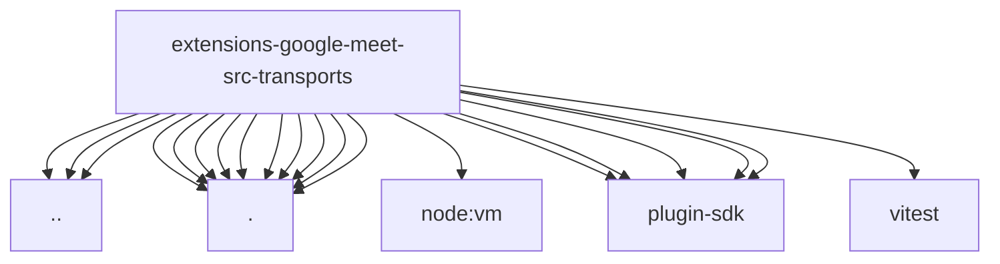

# Imports

[← Back to MODULE](MODULE.md) | [← Back to INDEX](../../INDEX.md)

## Dependency Graph

## External Dependencies

Dependencies from other modules:

- `../agent-consult.js`
- `../config.js`
- `../meet-url.js`
- `./chrome-audio-device.js`
- `./chrome-browser-proxy.js`
- `./chrome-create.js`
- `./chrome.js`
- `./google-meet-page-scripts.js`
- `./google-meet-platform-adapter.js`
- `./google-meet-platform-constants.js`
- `./google-meet-urls.js`
- `./twilio.js`
- `./types.js`
- `node:vm`
- `openclaw/plugin-sdk/error-runtime`
- `openclaw/plugin-sdk/meeting-runtime`
- `openclaw/plugin-sdk/number-runtime`
- `openclaw/plugin-sdk/runtime-env`
- `openclaw/plugin-sdk/string-coerce-runtime`
- `vitest`
