# Imports

[← Back to MODULE](MODULE.md) | [← Back to INDEX](../../INDEX.md)

## Dependency Graph

```mermaid
graph TD
    extensions_google_meet[extensions-google-meet] --> _[.]
    extensions_google_meet[extensions-google-meet] --> _[.]
    extensions_google_meet[extensions-google-meet] --> _[.]
    extensions_google_meet[extensions-google-meet] --> _[.]
    extensions_google_meet[extensions-google-meet] --> _[.]
    extensions_google_meet[extensions-google-meet] --> _[.]
    extensions_google_meet[extensions-google-meet] --> _[.]
    extensions_google_meet[extensions-google-meet] --> _[.]
    extensions_google_meet[extensions-google-meet] --> _[.]
    extensions_google_meet[extensions-google-meet] --> _[.]
    extensions_google_meet[extensions-google-meet] --> _[.]
    extensions_google_meet[extensions-google-meet] --> _[.]
    extensions_google_meet[extensions-google-meet] --> _[.]
    extensions_google_meet[extensions-google-meet] --> _[.]
    extensions_google_meet[extensions-google-meet] --> _[.]
    extensions_google_meet[extensions-google-meet] --> _[.]
    extensions_google_meet[extensions-google-meet] --> src[src]
    extensions_google_meet[extensions-google-meet] --> src[src]
    extensions_google_meet[extensions-google-meet] --> src[src]
    extensions_google_meet[extensions-google-meet] --> src[src]
    extensions_google_meet[extensions-google-meet] --> src[src]
    extensions_google_meet[extensions-google-meet] --> src[src]
    extensions_google_meet[extensions-google-meet] --> src[src]
    extensions_google_meet[extensions-google-meet] --> src[src]
    extensions_google_meet[extensions-google-meet] --> src[src]
    extensions_google_meet[extensions-google-meet] --> src[src]
    extensions_google_meet[extensions-google-meet] --> test_support[test-support]
    extensions_google_meet[extensions-google-meet] --> transports[transports]
    extensions_google_meet[extensions-google-meet] --> transports[transports]
    extensions_google_meet[extensions-google-meet] --> transports[transports]
    extensions_google_meet[extensions-google-meet] --> transports[transports]
    extensions_google_meet[extensions-google-meet] --> transports[transports]
    extensions_google_meet[extensions-google-meet] --> transports[transports]
    extensions_google_meet[extensions-google-meet] --> transports[transports]
    extensions_google_meet[extensions-google-meet] --> transports[transports]
    extensions_google_meet[extensions-google-meet] --> transports[transports]
    extensions_google_meet[extensions-google-meet] --> transports[transports]
    extensions_google_meet[extensions-google-meet] --> _[.]
    extensions_google_meet[extensions-google-meet] --> commander[commander]
    extensions_google_meet[extensions-google-meet] --> jszip[jszip]
    extensions_google_meet[extensions-google-meet] --> node_child_process[node:child_process]
    extensions_google_meet[extensions-google-meet] --> node_crypto[node:crypto]
    extensions_google_meet[extensions-google-meet] --> node_events[node:events]
    extensions_google_meet[extensions-google-meet] --> node_fs[node:fs]
    extensions_google_meet[extensions-google-meet] --> node_fs[node:fs]
    extensions_google_meet[extensions-google-meet] --> node_http[node:http]
    extensions_google_meet[extensions-google-meet] --> node_os[node:os]
    extensions_google_meet[extensions-google-meet] --> node_path[node:path]
    extensions_google_meet[extensions-google-meet] --> node_readline[node:readline]
    extensions_google_meet[extensions-google-meet] --> node_stream[node:stream]
    extensions_google_meet[extensions-google-meet] --> node_util[node:util]
    extensions_google_meet[extensions-google-meet] --> node_vm[node:vm]
    extensions_google_meet[extensions-google-meet] --> plugin_sdk[plugin-sdk]
    extensions_google_meet[extensions-google-meet] --> plugin_sdk[plugin-sdk]
    extensions_google_meet[extensions-google-meet] --> plugin_sdk[plugin-sdk]
    extensions_google_meet[extensions-google-meet] --> plugin_sdk[plugin-sdk]
    extensions_google_meet[extensions-google-meet] --> plugin_sdk[plugin-sdk]
    extensions_google_meet[extensions-google-meet] --> plugin_sdk[plugin-sdk]
    extensions_google_meet[extensions-google-meet] --> plugin_sdk[plugin-sdk]
    extensions_google_meet[extensions-google-meet] --> plugin_sdk[plugin-sdk]
    extensions_google_meet[extensions-google-meet] --> plugin_sdk[plugin-sdk]
    extensions_google_meet[extensions-google-meet] --> plugin_sdk[plugin-sdk]
    extensions_google_meet[extensions-google-meet] --> plugin_sdk[plugin-sdk]
    extensions_google_meet[extensions-google-meet] --> plugin_sdk[plugin-sdk]
    extensions_google_meet[extensions-google-meet] --> plugin_sdk[plugin-sdk]
    extensions_google_meet[extensions-google-meet] --> plugin_sdk[plugin-sdk]
    extensions_google_meet[extensions-google-meet] --> plugin_sdk[plugin-sdk]
    extensions_google_meet[extensions-google-meet] --> plugin_sdk[plugin-sdk]
    extensions_google_meet[extensions-google-meet] --> plugin_sdk[plugin-sdk]
    extensions_google_meet[extensions-google-meet] --> plugin_sdk[plugin-sdk]
    extensions_google_meet[extensions-google-meet] --> plugin_sdk[plugin-sdk]
    extensions_google_meet[extensions-google-meet] --> pretty_ms[pretty-ms]
    extensions_google_meet[extensions-google-meet] --> typebox[typebox]
    extensions_google_meet[extensions-google-meet] --> vitest[vitest]
```

## External Dependencies

Dependencies from other modules:

- `./agent-consult.js`
- `./calendar.js`
- `./cli.js`
- `./config-compat.js`
- `./config.js`
- `./create.js`
- `./drive.js`
- `./google-api-errors.js`
- `./meet-url.js`
- `./meet.js`
- `./node-invoke-policy.js`
- `./oauth.js`
- `./runtime-probes.js`
- `./runtime-session.js`
- `./runtime-setup.js`
- `./setup.js`
- `./src/agent-consult.js`
- `./src/calendar.js`
- `./src/cli.js`
- `./src/config.js`
- `./src/meet-url.js`
- `./src/meet.js`
- `./src/node-host.js`
- `./src/node-invoke-policy.js`
- `./src/oauth.js`
- `./src/runtime.js`
- `./src/test-support/plugin-harness.js`
- `./src/transports/chrome-create.js`
- `./src/transports/google-meet-platform-adapter.js`
- `./src/transports/twilio.js`
- `./transports/chrome-audio-device.js`
- `./transports/chrome-browser-proxy.js`
- `./transports/chrome-create.js`
- `./transports/chrome.js`
- `./transports/google-meet-platform-adapter.js`
- `./transports/google-meet-platform-constants.js`
- `./transports/twilio.js`
- `./voice-call-gateway.js`
- `commander`
- `jszip`
- `node:child_process`
- `node:crypto`
- `node:events`
- `node:fs`
- `node:fs/promises`
- `node:http`
- `node:os`
- `node:path`
- `node:readline/promises`
- `node:stream`
- `node:util`
- `node:vm`
- `openclaw/plugin-sdk/channel-actions`
- `openclaw/plugin-sdk/error-runtime`
- `openclaw/plugin-sdk/gateway-runtime`
- `openclaw/plugin-sdk/json-schema-runtime`
- `openclaw/plugin-sdk/lazy-runtime`
- `openclaw/plugin-sdk/meeting-runtime`
- `openclaw/plugin-sdk/number-runtime`
- `openclaw/plugin-sdk/plugin-entry`
- `openclaw/plugin-sdk/plugin-test-api`
- `openclaw/plugin-sdk/provider-auth`
- `openclaw/plugin-sdk/provider-auth-runtime`
- `openclaw/plugin-sdk/provider-http`
- `openclaw/plugin-sdk/realtime-voice`
- `openclaw/plugin-sdk/routing`
- `openclaw/plugin-sdk/runtime-env`
- `openclaw/plugin-sdk/ssrf-runtime`
- `openclaw/plugin-sdk/string-coerce-runtime`
- `openclaw/plugin-sdk/test-live`
- `openclaw/plugin-sdk/tool-results`
- `pretty-ms`
- `typebox`
- `vitest`
