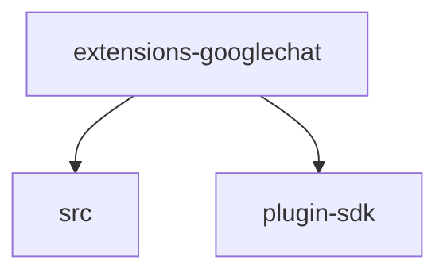

# Module: extensions/googlechat

[← Back to INDEX](../../INDEX.md)

**Type:** js/ts | **Files:** 12

**Entry point:** `extensions/googlechat/index.ts`

## Files

| File | Lines | Large |
| ---- | ----- | ----- |
| `extensions/googlechat/api.ts` | 4 |  |
| `extensions/googlechat/channel-config-api.ts` | 2 |  |
| `extensions/googlechat/channel-plugin-api.ts` | 2 |  |
| `extensions/googlechat/config-api.ts` | 3 |  |
| `extensions/googlechat/directory-contract-api.ts` | 7 |  |
| `extensions/googlechat/doctor-contract-api.ts` | 2 |  |
| `extensions/googlechat/index.ts` | 21 |  |
| `extensions/googlechat/runtime-api.ts` | 54 |  |
| `extensions/googlechat/secret-contract-api.ts` | 6 |  |
| `extensions/googlechat/setup-entry.ts` | 14 |  |
| `extensions/googlechat/setup-plugin-api.ts` | 3 |  |
| `extensions/googlechat/test-api.ts` | 3 |  |

## Child Modules

- [extensions-googlechat-src](../extensions-googlechat-src/MODULE.md)

---

## External Dependencies

Dependencies from other modules:

- `./src/channel.adapters.js`
- `openclaw/plugin-sdk/channel-entry-contract`
