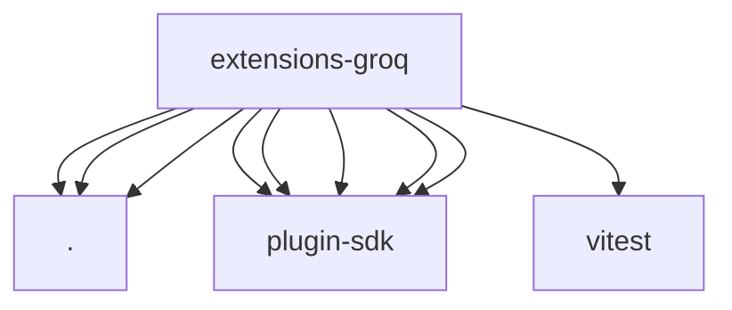

# Imports

[← Back to MODULE](MODULE.md) | [← Back to INDEX](../../INDEX.md)

## Dependency Graph

## External Dependencies

Dependencies from other modules:

- `./api.js`
- `./index.js`
- `./media-understanding-provider.js`
- `openclaw/plugin-sdk/llm`
- `openclaw/plugin-sdk/media-understanding`
- `openclaw/plugin-sdk/plugin-entry`
- `openclaw/plugin-sdk/plugin-test-runtime`
- `openclaw/plugin-sdk/provider-auth-api-key`
- `vitest`
