# Imports

[← Back to MODULE](MODULE.md) | [← Back to INDEX](../../INDEX.md)

## Dependency Graph

```mermaid
graph TD
    extensions_imessage_src_monitor[extensions-imessage-src-monitor] --> __[..]
    extensions_imessage_src_monitor[extensions-imessage-src-monitor] --> __[..]
    extensions_imessage_src_monitor[extensions-imessage-src-monitor] --> __[..]
    extensions_imessage_src_monitor[extensions-imessage-src-monitor] --> __[..]
    extensions_imessage_src_monitor[extensions-imessage-src-monitor] --> __[..]
    extensions_imessage_src_monitor[extensions-imessage-src-monitor] --> __[..]
    extensions_imessage_src_monitor[extensions-imessage-src-monitor] --> __[..]
    extensions_imessage_src_monitor[extensions-imessage-src-monitor] --> __[..]
    extensions_imessage_src_monitor[extensions-imessage-src-monitor] --> __[..]
    extensions_imessage_src_monitor[extensions-imessage-src-monitor] --> __[..]
    extensions_imessage_src_monitor[extensions-imessage-src-monitor] --> __[..]
    extensions_imessage_src_monitor[extensions-imessage-src-monitor] --> __[..]
    extensions_imessage_src_monitor[extensions-imessage-src-monitor] --> __[..]
    extensions_imessage_src_monitor[extensions-imessage-src-monitor] --> __[..]
    extensions_imessage_src_monitor[extensions-imessage-src-monitor] --> test_support[test-support]
    extensions_imessage_src_monitor[extensions-imessage-src-monitor] --> _[.]
    extensions_imessage_src_monitor[extensions-imessage-src-monitor] --> _[.]
    extensions_imessage_src_monitor[extensions-imessage-src-monitor] --> _[.]
    extensions_imessage_src_monitor[extensions-imessage-src-monitor] --> _[.]
    extensions_imessage_src_monitor[extensions-imessage-src-monitor] --> _[.]
    extensions_imessage_src_monitor[extensions-imessage-src-monitor] --> _[.]
    extensions_imessage_src_monitor[extensions-imessage-src-monitor] --> _[.]
    extensions_imessage_src_monitor[extensions-imessage-src-monitor] --> _[.]
    extensions_imessage_src_monitor[extensions-imessage-src-monitor] --> _[.]
    extensions_imessage_src_monitor[extensions-imessage-src-monitor] --> _[.]
    extensions_imessage_src_monitor[extensions-imessage-src-monitor] --> _[.]
    extensions_imessage_src_monitor[extensions-imessage-src-monitor] --> _[.]
    extensions_imessage_src_monitor[extensions-imessage-src-monitor] --> _[.]
    extensions_imessage_src_monitor[extensions-imessage-src-monitor] --> _[.]
    extensions_imessage_src_monitor[extensions-imessage-src-monitor] --> _[.]
    extensions_imessage_src_monitor[extensions-imessage-src-monitor] --> _[.]
    extensions_imessage_src_monitor[extensions-imessage-src-monitor] --> _[.]
    extensions_imessage_src_monitor[extensions-imessage-src-monitor] --> _[.]
    extensions_imessage_src_monitor[extensions-imessage-src-monitor] --> _[.]
    extensions_imessage_src_monitor[extensions-imessage-src-monitor] --> _[.]
    extensions_imessage_src_monitor[extensions-imessage-src-monitor] --> _[.]
    extensions_imessage_src_monitor[extensions-imessage-src-monitor] --> _[.]
    extensions_imessage_src_monitor[extensions-imessage-src-monitor] --> _[.]
    extensions_imessage_src_monitor[extensions-imessage-src-monitor] --> _[.]
    extensions_imessage_src_monitor[extensions-imessage-src-monitor] --> _[.]
    extensions_imessage_src_monitor[extensions-imessage-src-monitor] --> _[.]
    extensions_imessage_src_monitor[extensions-imessage-src-monitor] --> _[.]
    extensions_imessage_src_monitor[extensions-imessage-src-monitor] --> _[.]
    extensions_imessage_src_monitor[extensions-imessage-src-monitor] --> _[.]
    extensions_imessage_src_monitor[extensions-imessage-src-monitor] --> _[.]
    extensions_imessage_src_monitor[extensions-imessage-src-monitor] --> _[.]
    extensions_imessage_src_monitor[extensions-imessage-src-monitor] --> _[.]
    extensions_imessage_src_monitor[extensions-imessage-src-monitor] --> _[.]
    extensions_imessage_src_monitor[extensions-imessage-src-monitor] --> _[.]
    extensions_imessage_src_monitor[extensions-imessage-src-monitor] --> node_crypto[node:crypto]
    extensions_imessage_src_monitor[extensions-imessage-src-monitor] --> node_fs[node:fs]
    extensions_imessage_src_monitor[extensions-imessage-src-monitor] --> node_os[node:os]
    extensions_imessage_src_monitor[extensions-imessage-src-monitor] --> node_path[node:path]
    extensions_imessage_src_monitor[extensions-imessage-src-monitor] --> plugin_sdk[plugin-sdk]
    extensions_imessage_src_monitor[extensions-imessage-src-monitor] --> plugin_sdk[plugin-sdk]
    extensions_imessage_src_monitor[extensions-imessage-src-monitor] --> plugin_sdk[plugin-sdk]
    extensions_imessage_src_monitor[extensions-imessage-src-monitor] --> plugin_sdk[plugin-sdk]
    extensions_imessage_src_monitor[extensions-imessage-src-monitor] --> plugin_sdk[plugin-sdk]
    extensions_imessage_src_monitor[extensions-imessage-src-monitor] --> plugin_sdk[plugin-sdk]
    extensions_imessage_src_monitor[extensions-imessage-src-monitor] --> plugin_sdk[plugin-sdk]
    extensions_imessage_src_monitor[extensions-imessage-src-monitor] --> plugin_sdk[plugin-sdk]
    extensions_imessage_src_monitor[extensions-imessage-src-monitor] --> plugin_sdk[plugin-sdk]
    extensions_imessage_src_monitor[extensions-imessage-src-monitor] --> plugin_sdk[plugin-sdk]
    extensions_imessage_src_monitor[extensions-imessage-src-monitor] --> plugin_sdk[plugin-sdk]
    extensions_imessage_src_monitor[extensions-imessage-src-monitor] --> plugin_sdk[plugin-sdk]
    extensions_imessage_src_monitor[extensions-imessage-src-monitor] --> plugin_sdk[plugin-sdk]
    extensions_imessage_src_monitor[extensions-imessage-src-monitor] --> plugin_sdk[plugin-sdk]
    extensions_imessage_src_monitor[extensions-imessage-src-monitor] --> plugin_sdk[plugin-sdk]
    extensions_imessage_src_monitor[extensions-imessage-src-monitor] --> plugin_sdk[plugin-sdk]
    extensions_imessage_src_monitor[extensions-imessage-src-monitor] --> plugin_sdk[plugin-sdk]
    extensions_imessage_src_monitor[extensions-imessage-src-monitor] --> plugin_sdk[plugin-sdk]
    extensions_imessage_src_monitor[extensions-imessage-src-monitor] --> plugin_sdk[plugin-sdk]
    extensions_imessage_src_monitor[extensions-imessage-src-monitor] --> plugin_sdk[plugin-sdk]
    extensions_imessage_src_monitor[extensions-imessage-src-monitor] --> plugin_sdk[plugin-sdk]
    extensions_imessage_src_monitor[extensions-imessage-src-monitor] --> plugin_sdk[plugin-sdk]
    extensions_imessage_src_monitor[extensions-imessage-src-monitor] --> plugin_sdk[plugin-sdk]
    extensions_imessage_src_monitor[extensions-imessage-src-monitor] --> plugin_sdk[plugin-sdk]
    extensions_imessage_src_monitor[extensions-imessage-src-monitor] --> plugin_sdk[plugin-sdk]
    extensions_imessage_src_monitor[extensions-imessage-src-monitor] --> plugin_sdk[plugin-sdk]
    extensions_imessage_src_monitor[extensions-imessage-src-monitor] --> plugin_sdk[plugin-sdk]
    extensions_imessage_src_monitor[extensions-imessage-src-monitor] --> plugin_sdk[plugin-sdk]
    extensions_imessage_src_monitor[extensions-imessage-src-monitor] --> plugin_sdk[plugin-sdk]
    extensions_imessage_src_monitor[extensions-imessage-src-monitor] --> plugin_sdk[plugin-sdk]
    extensions_imessage_src_monitor[extensions-imessage-src-monitor] --> plugin_sdk[plugin-sdk]
    extensions_imessage_src_monitor[extensions-imessage-src-monitor] --> plugin_sdk[plugin-sdk]
    extensions_imessage_src_monitor[extensions-imessage-src-monitor] --> plugin_sdk[plugin-sdk]
    extensions_imessage_src_monitor[extensions-imessage-src-monitor] --> plugin_sdk[plugin-sdk]
    extensions_imessage_src_monitor[extensions-imessage-src-monitor] --> plugin_sdk[plugin-sdk]
    extensions_imessage_src_monitor[extensions-imessage-src-monitor] --> plugin_sdk[plugin-sdk]
    extensions_imessage_src_monitor[extensions-imessage-src-monitor] --> plugin_sdk[plugin-sdk]
    extensions_imessage_src_monitor[extensions-imessage-src-monitor] --> vitest[vitest]
```

## External Dependencies

Dependencies from other modules:

- `../accounts.js`
- `../approval-reaction-poller.js`
- `../approval-reactions.js`
- `../chat.js`
- `../client.js`
- `../constants.js`
- `../conversation-route.js`
- `../media-contract.js`
- `../monitor-reply-cache.js`
- `../probe.js`
- `../question-reactions.js`
- `../runtime.js`
- `../send.js`
- `../targets.js`
- `../test-support/runtime.js`
- `./abort-handler.js`
- `./catchup-bridge.js`
- `./catchup-bridge.test-support.js`
- `./catchup.js`
- `./coalesce.js`
- `./conversation-repair.js`
- `./deliver.js`
- `./deliver.runtime.js`
- `./dm-history.js`
- `./drop-diagnostic-cache.js`
- `./echo-cache.js`
- `./echo-text-corruption.js`
- `./group-allowlist-warnings.js`
- `./inbound-dedupe.js`
- `./inbound-processing.js`
- `./ingress.js`
- `./loop-rate-limiter.js`
- `./loop-rate-limiter.test-support.js`
- `./media-staging.js`
- `./monitor-provider.echo-cache.test-support.js`
- `./parse-notification.js`
- `./persisted-echo-cache.js`
- `./poll-comment.js`
- `./poll-render.js`
- `./reaction-context.js`
- `./reaction-system-event.js`
- `./recovery-cursor.js`
- `./reflection-guard.js`
- `./runtime.js`
- `./sanitize-outbound.js`
- `./self-chat-cache.js`
- `./self-chat-cache.test-support.js`
- `./strip-imsg-length-prefixed-text.js`
- `./watch-error-log.js`
- `node:crypto`
- `node:fs/promises`
- `node:os`
- `node:path`
- `openclaw/plugin-sdk/agent-runtime`
- `openclaw/plugin-sdk/approval-handler-runtime`
- `openclaw/plugin-sdk/channel-feedback`
- `openclaw/plugin-sdk/channel-inbound`
- `openclaw/plugin-sdk/channel-ingress-runtime`
- `openclaw/plugin-sdk/channel-outbound`
- `openclaw/plugin-sdk/channel-pairing`
- `openclaw/plugin-sdk/channel-policy`
- `openclaw/plugin-sdk/channel-runtime-context`
- `openclaw/plugin-sdk/command-auth-native`
- `openclaw/plugin-sdk/context-visibility-runtime`
- `openclaw/plugin-sdk/conversation-runtime`
- `openclaw/plugin-sdk/dedupe-runtime`
- `openclaw/plugin-sdk/error-runtime`
- `openclaw/plugin-sdk/expect-runtime`
- `openclaw/plugin-sdk/host-runtime`
- `openclaw/plugin-sdk/keyed-async-queue`
- `openclaw/plugin-sdk/media-runtime`
- `openclaw/plugin-sdk/media-store`
- `openclaw/plugin-sdk/number-runtime`
- `openclaw/plugin-sdk/plugin-state-test-runtime`
- `openclaw/plugin-sdk/reply-history`
- `openclaw/plugin-sdk/reply-payload`
- `openclaw/plugin-sdk/reply-runtime`
- `openclaw/plugin-sdk/routing`
- `openclaw/plugin-sdk/runtime-config-snapshot`
- `openclaw/plugin-sdk/runtime-env`
- `openclaw/plugin-sdk/runtime-group-policy`
- `openclaw/plugin-sdk/security-runtime`
- `openclaw/plugin-sdk/session-store-runtime`
- `openclaw/plugin-sdk/string-coerce-runtime`
- `openclaw/plugin-sdk/system-event-runtime`
- `openclaw/plugin-sdk/test-fixtures`
- `openclaw/plugin-sdk/text-chunking`
- `openclaw/plugin-sdk/text-utility-runtime`
- `openclaw/plugin-sdk/transport-ready-runtime`
- `openclaw/plugin-sdk/web-media`
- `vitest`
