# Imports

[← Back to MODULE](MODULE.md) | [← Back to INDEX](../../INDEX.md)

## Dependency Graph

```mermaid
graph TD
    extensions_irc_src[extensions-irc-src] --> _[.]
    extensions_irc_src[extensions-irc-src] --> _[.]
    extensions_irc_src[extensions-irc-src] --> _[.]
    extensions_irc_src[extensions-irc-src] --> _[.]
    extensions_irc_src[extensions-irc-src] --> _[.]
    extensions_irc_src[extensions-irc-src] --> _[.]
    extensions_irc_src[extensions-irc-src] --> _[.]
    extensions_irc_src[extensions-irc-src] --> _[.]
    extensions_irc_src[extensions-irc-src] --> _[.]
    extensions_irc_src[extensions-irc-src] --> _[.]
    extensions_irc_src[extensions-irc-src] --> _[.]
    extensions_irc_src[extensions-irc-src] --> _[.]
    extensions_irc_src[extensions-irc-src] --> _[.]
    extensions_irc_src[extensions-irc-src] --> _[.]
    extensions_irc_src[extensions-irc-src] --> _[.]
    extensions_irc_src[extensions-irc-src] --> _[.]
    extensions_irc_src[extensions-irc-src] --> _[.]
    extensions_irc_src[extensions-irc-src] --> _[.]
    extensions_irc_src[extensions-irc-src] --> _[.]
    extensions_irc_src[extensions-irc-src] --> _[.]
    extensions_irc_src[extensions-irc-src] --> _[.]
    extensions_irc_src[extensions-irc-src] --> _[.]
    extensions_irc_src[extensions-irc-src] --> _[.]
    extensions_irc_src[extensions-irc-src] --> node_crypto[node:crypto]
    extensions_irc_src[extensions-irc-src] --> node_fs[node:fs]
    extensions_irc_src[extensions-irc-src] --> node_fs[node:fs]
    extensions_irc_src[extensions-irc-src] --> node_net[node:net]
    extensions_irc_src[extensions-irc-src] --> node_os[node:os]
    extensions_irc_src[extensions-irc-src] --> node_path[node:path]
    extensions_irc_src[extensions-irc-src] --> node_tls[node:tls]
    extensions_irc_src[extensions-irc-src] --> plugin_sdk[plugin-sdk]
    extensions_irc_src[extensions-irc-src] --> plugin_sdk[plugin-sdk]
    extensions_irc_src[extensions-irc-src] --> plugin_sdk[plugin-sdk]
    extensions_irc_src[extensions-irc-src] --> plugin_sdk[plugin-sdk]
    extensions_irc_src[extensions-irc-src] --> plugin_sdk[plugin-sdk]
    extensions_irc_src[extensions-irc-src] --> plugin_sdk[plugin-sdk]
    extensions_irc_src[extensions-irc-src] --> plugin_sdk[plugin-sdk]
    extensions_irc_src[extensions-irc-src] --> plugin_sdk[plugin-sdk]
    extensions_irc_src[extensions-irc-src] --> plugin_sdk[plugin-sdk]
    extensions_irc_src[extensions-irc-src] --> plugin_sdk[plugin-sdk]
    extensions_irc_src[extensions-irc-src] --> plugin_sdk[plugin-sdk]
    extensions_irc_src[extensions-irc-src] --> plugin_sdk[plugin-sdk]
    extensions_irc_src[extensions-irc-src] --> plugin_sdk[plugin-sdk]
    extensions_irc_src[extensions-irc-src] --> plugin_sdk[plugin-sdk]
    extensions_irc_src[extensions-irc-src] --> plugin_sdk[plugin-sdk]
    extensions_irc_src[extensions-irc-src] --> plugin_sdk[plugin-sdk]
    extensions_irc_src[extensions-irc-src] --> plugin_sdk[plugin-sdk]
    extensions_irc_src[extensions-irc-src] --> plugin_sdk[plugin-sdk]
    extensions_irc_src[extensions-irc-src] --> plugin_sdk[plugin-sdk]
    extensions_irc_src[extensions-irc-src] --> plugin_sdk[plugin-sdk]
    extensions_irc_src[extensions-irc-src] --> plugin_sdk[plugin-sdk]
    extensions_irc_src[extensions-irc-src] --> plugin_sdk[plugin-sdk]
    extensions_irc_src[extensions-irc-src] --> plugin_sdk[plugin-sdk]
    extensions_irc_src[extensions-irc-src] --> plugin_sdk[plugin-sdk]
    extensions_irc_src[extensions-irc-src] --> plugin_sdk[plugin-sdk]
    extensions_irc_src[extensions-irc-src] --> plugin_sdk[plugin-sdk]
    extensions_irc_src[extensions-irc-src] --> plugin_sdk[plugin-sdk]
    extensions_irc_src[extensions-irc-src] --> plugin_sdk[plugin-sdk]
    extensions_irc_src[extensions-irc-src] --> plugin_sdk[plugin-sdk]
    extensions_irc_src[extensions-irc-src] --> plugin_sdk[plugin-sdk]
    extensions_irc_src[extensions-irc-src] --> plugin_sdk[plugin-sdk]
    extensions_irc_src[extensions-irc-src] --> plugin_sdk[plugin-sdk]
    extensions_irc_src[extensions-irc-src] --> plugin_sdk[plugin-sdk]
    extensions_irc_src[extensions-irc-src] --> plugin_sdk[plugin-sdk]
    extensions_irc_src[extensions-irc-src] --> vitest[vitest]
    extensions_irc_src[extensions-irc-src] --> zod[zod]
```

## External Dependencies

Dependencies from other modules:

- `./accounts.js`
- `./channel-api.js`
- `./client.js`
- `./config-schema.js`
- `./config-ui-hints.js`
- `./connect-options.js`
- `./control-chars.js`
- `./doctor.js`
- `./gateway.js`
- `./inbound.js`
- `./irc-ingress.js`
- `./message-adapter.js`
- `./monitor.js`
- `./normalize.js`
- `./outbound-base.js`
- `./policy.js`
- `./probe.js`
- `./protocol.js`
- `./runtime.js`
- `./secret-contract.js`
- `./send.js`
- `./setup-core.js`
- `./setup-surface.js`
- `node:crypto`
- `node:fs`
- `node:fs/promises`
- `node:net`
- `node:os`
- `node:path`
- `node:tls`
- `openclaw/plugin-sdk/account-helpers`
- `openclaw/plugin-sdk/account-id`
- `openclaw/plugin-sdk/account-resolution`
- `openclaw/plugin-sdk/allow-from`
- `openclaw/plugin-sdk/channel-config-helpers`
- `openclaw/plugin-sdk/channel-config-schema`
- `openclaw/plugin-sdk/channel-core`
- `openclaw/plugin-sdk/channel-inbound`
- `openclaw/plugin-sdk/channel-ingress-runtime`
- `openclaw/plugin-sdk/channel-outbound`
- `openclaw/plugin-sdk/channel-pairing`
- `openclaw/plugin-sdk/channel-policy`
- `openclaw/plugin-sdk/channel-secret-basic-runtime`
- `openclaw/plugin-sdk/channel-test-helpers`
- `openclaw/plugin-sdk/dangerous-name-runtime`
- `openclaw/plugin-sdk/directory-runtime`
- `openclaw/plugin-sdk/extension-shared`
- `openclaw/plugin-sdk/lazy-runtime`
- `openclaw/plugin-sdk/markdown-table-runtime`
- `openclaw/plugin-sdk/number-runtime`
- `openclaw/plugin-sdk/plugin-config-runtime`
- `openclaw/plugin-sdk/plugin-state-test-runtime`
- `openclaw/plugin-sdk/plugin-test-runtime`
- `openclaw/plugin-sdk/reply-payload`
- `openclaw/plugin-sdk/routing`
- `openclaw/plugin-sdk/runtime-group-policy`
- `openclaw/plugin-sdk/runtime-store`
- `openclaw/plugin-sdk/secret-file-runtime`
- `openclaw/plugin-sdk/secret-input`
- `openclaw/plugin-sdk/security-runtime`
- `openclaw/plugin-sdk/setup`
- `openclaw/plugin-sdk/status-helpers`
- `openclaw/plugin-sdk/string-coerce-runtime`
- `openclaw/plugin-sdk/text-chunking`
- `vitest`
- `zod`
