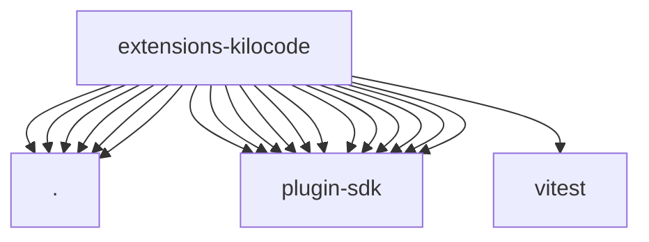

# Imports

[← Back to MODULE](MODULE.md) | [← Back to INDEX](../../INDEX.md)

## Dependency Graph

## External Dependencies

Dependencies from other modules:

- `./api.js`
- `./index.js`
- `./onboard.js`
- `./provider-catalog.js`
- `./provider-models.js`
- `./stream.js`
- `openclaw/plugin-sdk/plugin-test-runtime`
- `openclaw/plugin-sdk/provider-auth-runtime`
- `openclaw/plugin-sdk/provider-catalog-shared`
- `openclaw/plugin-sdk/provider-entry`
- `openclaw/plugin-sdk/provider-http`
- `openclaw/plugin-sdk/provider-model-shared`
- `openclaw/plugin-sdk/provider-onboard`
- `openclaw/plugin-sdk/provider-stream-shared`
- `openclaw/plugin-sdk/provider-test-contracts`
- `openclaw/plugin-sdk/runtime-env`
- `openclaw/plugin-sdk/ssrf-runtime`
- `openclaw/plugin-sdk/string-coerce-runtime`
- `vitest`
