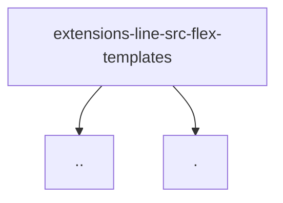

# Module: extensions/line/src/flex-templates

[← Back to INDEX](../../INDEX.md)

**Type:** implicit | **Files:** 6

## Files

| File | Lines | Large |
| ---- | ----- | ----- |
| `extensions/line/src/flex-templates/basic-cards.ts` | 396 |  |
| `extensions/line/src/flex-templates/common.ts` | 21 |  |
| `extensions/line/src/flex-templates/media-control-cards.ts` | 556 | 📊 |
| `extensions/line/src/flex-templates/message.ts` | 14 |  |
| `extensions/line/src/flex-templates/schedule-cards.ts` | 468 |  |
| `extensions/line/src/flex-templates/types.ts` | 23 |  |

---

Symbol maps for 1 large files in this module.

## extensions/line/src/flex-templates/media-control-cards.ts (556 lines)

| Line | Kind | Name | Visibility |
| ---- | ---- | ---- | ---------- |
| 18 | fn | createMediaPlayerCard | pub |
| 267 | fn | createAppleTvRemoteCard | pub |
| 408 | fn | createDeviceControlCard | pub |
---

## External Dependencies

Dependencies from other modules:

- `../actions.js`
- `./common.js`
