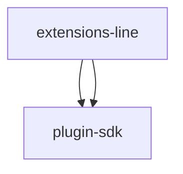

# Module: extensions/line

[← Back to INDEX](../../INDEX.md)

**Type:** js/ts | **Files:** 8

**Entry point:** `extensions/line/index.ts`

## Files

| File | Lines | Large |
| ---- | ----- | ----- |
| `extensions/line/api.ts` | 12 |  |
| `extensions/line/channel-plugin-api.ts` | 2 |  |
| `extensions/line/contract-api.ts` | 6 |  |
| `extensions/line/index.ts` | 54 |  |
| `extensions/line/runtime-api.ts` | 178 |  |
| `extensions/line/secret-contract-api.ts` | 4 |  |
| `extensions/line/setup-api.ts` | 3 |  |
| `extensions/line/setup-entry.ts` | 10 |  |

## Child Modules

- [extensions-line-src](../extensions-line-src/MODULE.md)

---

## External Dependencies

Dependencies from other modules:

- `openclaw/plugin-sdk/channel-entry-contract`
- `openclaw/plugin-sdk/lazy-runtime`
