# Imports

[← Back to MODULE](MODULE.md) | [← Back to INDEX](../../INDEX.md)

## Dependency Graph

```mermaid
graph TD
    extensions_linkbrain[extensions-linkbrain] --> fake[fake]
    extensions_linkbrain[extensions-linkbrain] --> _[.]
    extensions_linkbrain[extensions-linkbrain] --> _[.]
    extensions_linkbrain[extensions-linkbrain] --> _[.]
    extensions_linkbrain[extensions-linkbrain] --> _[.]
    extensions_linkbrain[extensions-linkbrain] --> src[src]
    extensions_linkbrain[extensions-linkbrain] --> src[src]
    extensions_linkbrain[extensions-linkbrain] --> src[src]
    extensions_linkbrain[extensions-linkbrain] --> src[src]
    extensions_linkbrain[extensions-linkbrain] --> src[src]
    extensions_linkbrain[extensions-linkbrain] --> src[src]
    extensions_linkbrain[extensions-linkbrain] --> src[src]
    extensions_linkbrain[extensions-linkbrain] --> src[src]
    extensions_linkbrain[extensions-linkbrain] --> src[src]
    extensions_linkbrain[extensions-linkbrain] --> src[src]
    extensions_linkbrain[extensions-linkbrain] --> src[src]
    extensions_linkbrain[extensions-linkbrain] --> src[src]
    extensions_linkbrain[extensions-linkbrain] --> src[src]
    extensions_linkbrain[extensions-linkbrain] --> src[src]
    extensions_linkbrain[extensions-linkbrain] --> src[src]
    extensions_linkbrain[extensions-linkbrain] --> test_support[test-support]
    extensions_linkbrain[extensions-linkbrain] --> test_support[test-support]
    extensions_linkbrain[extensions-linkbrain] --> src[src]
    extensions_linkbrain[extensions-linkbrain] --> src[src]
    extensions_linkbrain[extensions-linkbrain] --> src[src]
    extensions_linkbrain[extensions-linkbrain] --> src[src]
    extensions_linkbrain[extensions-linkbrain] --> _[.]
    extensions_linkbrain[extensions-linkbrain] --> ajv[ajv]
    extensions_linkbrain[extensions-linkbrain] --> ajv_formats[ajv-formats]
    extensions_linkbrain[extensions-linkbrain] --> dist[dist]
    extensions_linkbrain[extensions-linkbrain] --> node_fs[node:fs]
    extensions_linkbrain[extensions-linkbrain] --> node_http[node:http]
    extensions_linkbrain[extensions-linkbrain] --> node_path[node:path]
    extensions_linkbrain[extensions-linkbrain] --> node_process[node:process]
    extensions_linkbrain[extensions-linkbrain] --> node_url[node:url]
    extensions_linkbrain[extensions-linkbrain] --> plugin_sdk[plugin-sdk]
    extensions_linkbrain[extensions-linkbrain] --> vitest[vitest]
```

## External Dependencies

Dependencies from other modules:

- `./fake/runtime.mjs`
- `./index.js`
- `./mcp-tool-filter.js`
- `./runtime-api.js`
- `./runtime.mjs`
- `./src/auth-claims-1.1.js`
- `./src/bounded.js`
- `./src/capture-batch-adapter.js`
- `./src/capture.js`
- `./src/config.js`
- `./src/drain-worker.js`
- `./src/envelopes.js`
- `./src/feature-flags.js`
- `./src/lifecycle.js`
- `./src/namespaces.js`
- `./src/oauth-tool.js`
- `./src/opaque.js`
- `./src/runtime.js`
- `./src/sanitize.js`
- `./src/stores.js`
- `./src/test-support/deferred.js`
- `./src/test-support/memory-store.js`
- `./src/tools.js`
- `./src/transport.js`
- `./src/v2-pins.js`
- `./src/v2.js`
- `./v2-test-fixtures.js`
- `ajv`
- `ajv-formats`
- `ajv/dist/2020.js`
- `node:fs`
- `node:http`
- `node:path`
- `node:process`
- `node:url`
- `openclaw/plugin-sdk/plugin-test-api`
- `vitest`
