# Imports

[← Back to MODULE](MODULE.md) | [← Back to INDEX](../../INDEX.md)

## Dependency Graph

```mermaid
graph TD
    extensions_linkskills_fake[extensions-linkskills-fake] --> _[.]
    extensions_linkskills_fake[extensions-linkskills-fake] --> _[.]
    extensions_linkskills_fake[extensions-linkskills-fake] --> _[.]
    extensions_linkskills_fake[extensions-linkskills-fake] --> _[.]
    extensions_linkskills_fake[extensions-linkskills-fake] --> _[.]
    extensions_linkskills_fake[extensions-linkskills-fake] --> _[.]
    extensions_linkskills_fake[extensions-linkskills-fake] --> _[.]
    extensions_linkskills_fake[extensions-linkskills-fake] --> node_buffer[node:buffer]
    extensions_linkskills_fake[extensions-linkskills-fake] --> node_child_process[node:child_process]
    extensions_linkskills_fake[extensions-linkskills-fake] --> node_crypto[node:crypto]
    extensions_linkskills_fake[extensions-linkskills-fake] --> node_fs[node:fs]
    extensions_linkskills_fake[extensions-linkskills-fake] --> node_http[node:http]
    extensions_linkskills_fake[extensions-linkskills-fake] --> node_path[node:path]
    extensions_linkskills_fake[extensions-linkskills-fake] --> node_url[node:url]
    extensions_linkskills_fake[extensions-linkskills-fake] --> vitest[vitest]
```

## External Dependencies

Dependencies from other modules:

- `./auth.mjs`
- `./constants.mjs`
- `./harness.mjs`
- `./http-server.mjs`
- `./prohibited.mjs`
- `./service.mjs`
- `./stdio-mcp.mjs`
- `node:buffer`
- `node:child_process`
- `node:crypto`
- `node:fs`
- `node:http`
- `node:path`
- `node:url`
- `vitest`
