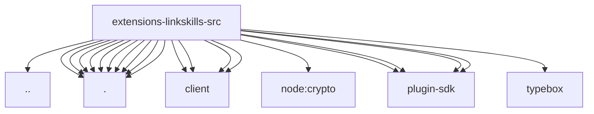

# Imports

[← Back to MODULE](MODULE.md) | [← Back to INDEX](../../INDEX.md)

## Dependency Graph

## External Dependencies

Dependencies from other modules:

- `../mcp-tool-filter.js`
- `./bounded.js`
- `./config.js`
- `./envelopes.js`
- `./exact-release.js`
- `./namespaces.js`
- `./opaque.js`
- `./runtime.js`
- `./tools.js`
- `./transport.js`
- `./v2.js`
- `@modelcontextprotocol/sdk/client/index.js`
- `@modelcontextprotocol/sdk/client/sse.js`
- `@modelcontextprotocol/sdk/client/stdio.js`
- `@modelcontextprotocol/sdk/client/streamableHttp.js`
- `node:crypto`
- `openclaw/plugin-sdk/machine-token-runtime`
- `openclaw/plugin-sdk/mcp-http-fetch`
- `openclaw/plugin-sdk/secret-input-runtime`
- `openclaw/plugin-sdk/ssrf-runtime`
- `typebox`
