# Imports

[← Back to MODULE](MODULE.md) | [← Back to INDEX](../../INDEX.md)

## Dependency Graph

```mermaid
graph TD
    extensions_linkskills[extensions-linkskills] --> linkbrain[linkbrain]
    extensions_linkskills[extensions-linkskills] --> linkskills[linkskills]
    extensions_linkskills[extensions-linkskills] --> _[.]
    extensions_linkskills[extensions-linkskills] --> fake[fake]
    extensions_linkskills[extensions-linkskills] --> fake[fake]
    extensions_linkskills[extensions-linkskills] --> fake[fake]
    extensions_linkskills[extensions-linkskills] --> _[.]
    extensions_linkskills[extensions-linkskills] --> _[.]
    extensions_linkskills[extensions-linkskills] --> _[.]
    extensions_linkskills[extensions-linkskills] --> src[src]
    extensions_linkskills[extensions-linkskills] --> src[src]
    extensions_linkskills[extensions-linkskills] --> src[src]
    extensions_linkskills[extensions-linkskills] --> src[src]
    extensions_linkskills[extensions-linkskills] --> src[src]
    extensions_linkskills[extensions-linkskills] --> src[src]
    extensions_linkskills[extensions-linkskills] --> src[src]
    extensions_linkskills[extensions-linkskills] --> src[src]
    extensions_linkskills[extensions-linkskills] --> src[src]
    extensions_linkskills[extensions-linkskills] --> src[src]
    extensions_linkskills[extensions-linkskills] --> src[src]
    extensions_linkskills[extensions-linkskills] --> src[src]
    extensions_linkskills[extensions-linkskills] --> test_support[test-support]
    extensions_linkskills[extensions-linkskills] --> src[src]
    extensions_linkskills[extensions-linkskills] --> src[src]
    extensions_linkskills[extensions-linkskills] --> src[src]
    extensions_linkskills[extensions-linkskills] --> node_crypto[node:crypto]
    extensions_linkskills[extensions-linkskills] --> node_fs[node:fs]
    extensions_linkskills[extensions-linkskills] --> node_path[node:path]
    extensions_linkskills[extensions-linkskills] --> node_url[node:url]
    extensions_linkskills[extensions-linkskills] --> plugin_sdk[plugin-sdk]
    extensions_linkskills[extensions-linkskills] --> plugin_sdk[plugin-sdk]
    extensions_linkskills[extensions-linkskills] --> plugin_sdk[plugin-sdk]
    extensions_linkskills[extensions-linkskills] --> vitest[vitest]
```

## External Dependencies

Dependencies from other modules:

- `../linkbrain/index.js`
- `../linkskills/index.js`
- `./api.js`
- `./fake/auth.mjs`
- `./fake/harness.mjs`
- `./fake/service.mjs`
- `./index.js`
- `./mcp-tool-filter.js`
- `./runtime-api.js`
- `./src/auth-claims-1.1.js`
- `./src/bounded.js`
- `./src/collect.js`
- `./src/config.js`
- `./src/drain-worker.js`
- `./src/envelopes.js`
- `./src/exact-release.js`
- `./src/feature-flags.js`
- `./src/namespaces.js`
- `./src/oauth-tool.js`
- `./src/runtime.js`
- `./src/stores.js`
- `./src/test-support/memory-store.js`
- `./src/tools.js`
- `./src/transport.js`
- `./src/v2.js`
- `node:crypto`
- `node:fs`
- `node:path`
- `node:url`
- `openclaw/plugin-sdk/channel-test-helpers`
- `openclaw/plugin-sdk/memory-host-core`
- `openclaw/plugin-sdk/plugin-test-api`
- `vitest`
