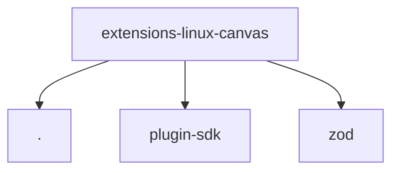

# Module: extensions/linux-canvas

[← Back to INDEX](../../INDEX.md)

**Type:** js/ts | **Files:** 2

**Entry point:** `extensions/linux-canvas/index.ts`

## Files

| File | Lines | Large |
| ---- | ----- | ----- |
| `extensions/linux-canvas/api.ts` | 1 |  |
| `extensions/linux-canvas/index.ts` | 17 |  |

## Child Modules

- [extensions-linux-canvas-src](../extensions-linux-canvas-src/MODULE.md)

---

## External Dependencies

Dependencies from other modules:

- `./api.js`
- `openclaw/plugin-sdk/plugin-entry`
- `zod`
