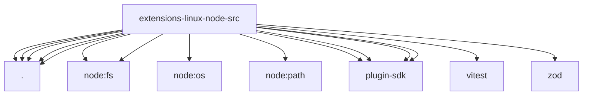

# Imports

[← Back to MODULE](MODULE.md) | [← Back to INDEX](../../INDEX.md)

## Dependency Graph

## External Dependencies

Dependencies from other modules:

- `./command-utils.js`
- `./commands.js`
- `./config.js`
- `./executables.js`
- `./location.js`
- `node:fs`
- `node:fs/promises`
- `node:os`
- `node:path`
- `openclaw/plugin-sdk/plugin-entry`
- `openclaw/plugin-sdk/process-runtime`
- `openclaw/plugin-sdk/temp-path`
- `openclaw/plugin-sdk/text-utility-runtime`
- `vitest`
- `zod`
